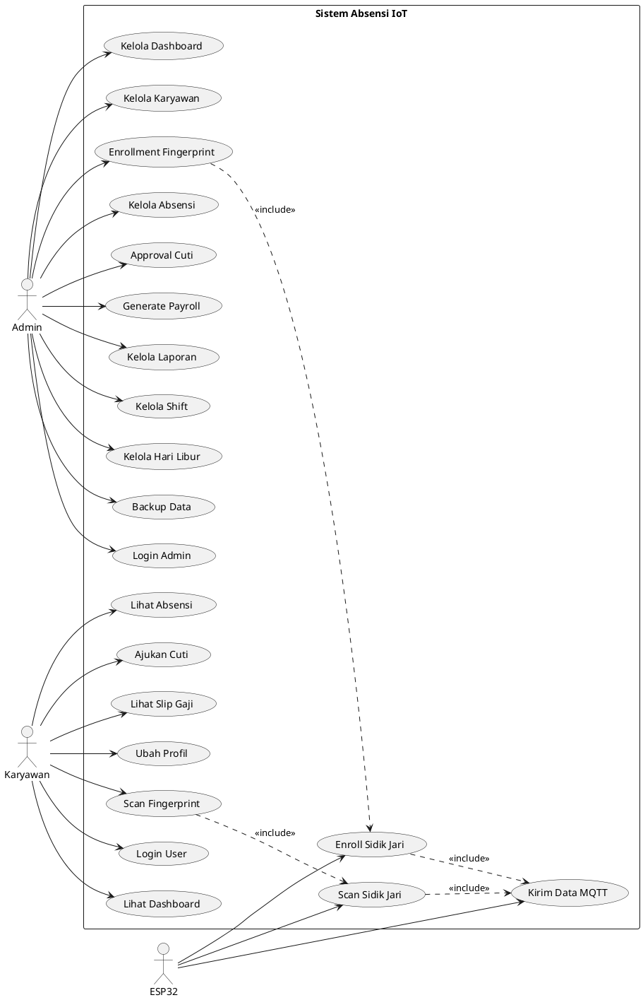

# LAPORAN SISTEM ABSENSI BERBASIS IoT

## Informasi Umum

| Item | Keterangan |
|------|------------|
| **Nama Sistem** | Sistem Absensi Berbasis IoT dengan Fingerprint |
| **Versi** | 1.0.0 |
| **Author** | Achmad Hasan (20210410700073) |
| **Jenis** | Tugas Akhir |
| **Tanggal Laporan** | 9 Desember 2025 |

---

## 1. Arsitektur Sistem

### 1.1 Diagram Arsitektur

```
┌─────────────────┐     MQTT      ┌──────────────────┐     HTTP/WS     ┌─────────────────┐
│                 │◄────────────►│                  │◄──────────────►│                 │
│   ESP32 +       │              │   Node.js        │                │   Web Browser   │
│   Fingerprint   │              │   Server         │                │   (Admin/User)  │
│   Sensor        │              │   (Port 3000)    │                │                 │
│                 │              │                  │                │                 │
└─────────────────┘              └────────┬─────────┘                └─────────────────┘
                                         │
                                         │ PostgreSQL
                                         ▼
                                 ┌──────────────────┐
                                 │                  │
                                 │   Database       │
                                 │   (db_absensi)   │
                                 │                  │
                                 └──────────────────┘
```

### 1.2 Komponen Utama

| Komponen | Teknologi | Fungsi |
|----------|-----------|--------|
| **Hardware** | ESP32 + Fingerprint Sensor | Capture sidik jari & kirim data |
| **Backend** | Node.js + Express 5.1 | REST API & Business Logic |
| **Database** | PostgreSQL | Penyimpanan data |
| **Realtime** | Socket.IO | Update data real-time |
| **Messaging** | MQTT (Aedes Broker) | Komunikasi ESP32 ↔ Server |
| **Frontend** | HTML/CSS/JS (Glassmorphism) | User Interface |

---

## 2. Use Case Diagram

### 2.1 Diagram Use Case

```
┌─────────────────────────────────────────────────────────────────────────────────────┐
│                           SISTEM ABSENSI BERBASIS IoT                                │
│                                                                                      │
│  ┌─────────────────────────────────────────────────────────────────────────────┐    │
│  │                              << Admin >>                                     │    │
│  │                                                                              │    │
│  │    ┌──────────────┐  ┌──────────────┐  ┌──────────────┐  ┌──────────────┐   │    │
│  │    │    Login     │  │   Kelola     │  │   Kelola     │  │  Enrollment  │   │    │
│  │    │    Admin     │  │  Dashboard   │  │  Karyawan    │  │ Fingerprint  │   │    │
│  │    └──────────────┘  └──────────────┘  └──────────────┘  └──────────────┘   │    │
│  │                                                                              │    │
│  │    ┌──────────────┐  ┌──────────────┐  ┌──────────────┐  ┌──────────────┐   │    │
│  │    │   Kelola     │  │   Approval   │  │   Generate   │  │    Kelola    │   │    │
│  │    │   Absensi    │  │    Cuti      │  │   Payroll    │  │   Laporan    │   │    │
│  │    └──────────────┘  └──────────────┘  └──────────────┘  └──────────────┘   │    │
│  │                                                                              │    │
│  │    ┌──────────────┐  ┌──────────────┐  ┌──────────────┐                     │    │
│  │    │   Kelola     │  │   Kelola     │  │   Backup     │                     │    │
│  │    │    Shift     │  │ Hari Libur   │  │   Data       │                     │    │
│  │    └──────────────┘  └──────────────┘  └──────────────┘                     │    │
│  └─────────────────────────────────────────────────────────────────────────────┘    │
│                                                                                      │
│  ┌─────────────────────────────────────────────────────────────────────────────┐    │
│  │                            << Karyawan >>                                    │    │
│  │                                                                              │    │
│  │    ┌──────────────┐  ┌──────────────┐  ┌──────────────┐  ┌──────────────┐   │    │
│  │    │    Login     │  │    Lihat     │  │    Lihat     │  │   Ajukan     │   │    │
│  │    │    User      │  │  Dashboard   │  │   Absensi    │  │    Cuti      │   │    │
│  │    └──────────────┘  └──────────────┘  └──────────────┘  └──────────────┘   │    │
│  │                                                                              │    │
│  │    ┌──────────────┐  ┌──────────────┐  ┌──────────────┐                     │    │
│  │    │    Lihat     │  │    Ubah      │  │    Scan      │                     │    │
│  │    │  Slip Gaji   │  │   Profil     │  │ Fingerprint  │                     │    │
│  │    └──────────────┘  └──────────────┘  └──────────────┘                     │    │
│  └─────────────────────────────────────────────────────────────────────────────┘    │
│                                                                                      │
│  ┌─────────────────────────────────────────────────────────────────────────────┐    │
│  │                              << ESP32 >>                                     │    │
│  │                                                                              │    │
│  │    ┌──────────────┐  ┌──────────────┐  ┌──────────────┐                     │    │
│  │    │    Scan      │  │   Enroll     │  │    Kirim     │                     │    │
│  │    │ Fingerprint  │  │ Fingerprint  │  │  Data MQTT   │                     │    │
│  │    └──────────────┘  └──────────────┘  └──────────────┘                     │    │
│  └─────────────────────────────────────────────────────────────────────────────┘    │
│                                                                                      │
└─────────────────────────────────────────────────────────────────────────────────────┘
```

### 2.2 Daftar Aktor

| No | Aktor | Deskripsi |
|----|-------|-----------|
| 1 | **Admin** | Pengelola sistem yang memiliki akses penuh untuk manajemen data |
| 2 | **Karyawan** | Pengguna sistem yang melakukan absensi dan mengakses data pribadi |
| 3 | **ESP32** | Perangkat IoT yang menangani scan dan enrollment sidik jari |

### 2.3 Daftar Use Case

#### A. Use Case Admin

| ID | Use Case | Deskripsi | Pre-condition | Post-condition |
|----|----------|-----------|---------------|----------------|
| UC-A01 | Login Admin | Admin masuk ke sistem | Admin terdaftar | Admin terautentikasi |
| UC-A02 | Kelola Dashboard | Melihat statistik realtime | Login berhasil | Dashboard ditampilkan |
| UC-A03 | Kelola Karyawan | CRUD data karyawan | Login berhasil | Data tersimpan |
| UC-A04 | Enrollment Fingerprint | Daftarkan sidik jari karyawan | Karyawan terdaftar | Fingerprint tersimpan |
| UC-A05 | Kelola Absensi | Lihat/edit riwayat absensi | Login berhasil | Data absensi dikelola |
| UC-A06 | Approval Cuti | Setujui/tolak pengajuan cuti | Ada pengajuan | Status cuti berubah |
| UC-A07 | Generate Payroll | Buat slip gaji bulanan | Data absensi lengkap | Payroll tersimpan |
| UC-A08 | Kelola Laporan | Buat & export laporan | Data tersedia | Laporan di-generate |
| UC-A09 | Kelola Shift | CRUD jadwal shift kerja | Login berhasil | Shift tersimpan |
| UC-A10 | Kelola Hari Libur | CRUD hari libur | Login berhasil | Hari libur tersimpan |
| UC-A11 | Backup Data | Backup ke ownCloud | Konfigurasi lengkap | Data ter-backup |

#### B. Use Case Karyawan

| ID | Use Case | Deskripsi | Pre-condition | Post-condition |
|----|----------|-----------|---------------|----------------|
| UC-K01 | Login User | Karyawan masuk dengan NIP | Karyawan terdaftar | User terautentikasi |
| UC-K02 | Lihat Dashboard | Lihat statistik kehadiran | Login berhasil | Dashboard ditampilkan |
| UC-K03 | Lihat Absensi | Lihat riwayat absensi pribadi | Login berhasil | Riwayat ditampilkan |
| UC-K04 | Ajukan Cuti | Mengajukan cuti/izin | Login berhasil | Pengajuan tersimpan |
| UC-K05 | Lihat Slip Gaji | Melihat slip gaji bulanan | Payroll di-generate | Slip gaji ditampilkan |
| UC-K06 | Ubah Profil | Update data & password | Login berhasil | Profil ter-update |
| UC-K07 | Scan Fingerprint | Melakukan absensi sidik jari | Fingerprint terdaftar | Absensi tercatat |

#### C. Use Case ESP32

| ID | Use Case | Deskripsi | Pre-condition | Post-condition |
|----|----------|-----------|---------------|----------------|
| UC-E01 | Scan Fingerprint | Baca sidik jari untuk absensi | ESP32 terhubung | Data dikirim ke server |
| UC-E02 | Enroll Fingerprint | Daftarkan sidik jari baru | Command dari server | Fingerprint tersimpan |
| UC-E03 | Kirim Data MQTT | Kirim data ke server via MQTT | WiFi terhubung | Data sampai ke server |

### 2.4 Use Case Diagram (PlantUML Format)



### 2.5 Skenario Use Case Detail

#### UC-K07: Scan Fingerprint (Absensi)

| Item | Deskripsi |
|------|-----------|
| **Use Case ID** | UC-K07 |
| **Nama** | Scan Fingerprint |
| **Aktor** | Karyawan, ESP32 |
| **Deskripsi** | Karyawan melakukan absensi dengan scan sidik jari |
| **Pre-condition** | - Karyawan sudah terdaftar<br>- Fingerprint sudah di-enroll<br>- ESP32 terhubung ke jaringan |
| **Post-condition** | Data absensi tersimpan di database |

**Skenario Utama (Main Flow):**

| Step | Aktor | Sistem |
|------|-------|--------|
| 1 | Karyawan menempelkan jari pada sensor | - |
| 2 | - | ESP32 membaca sidik jari |
| 3 | - | ESP32 memverifikasi fingerprint |
| 4 | - | ESP32 mengirim data via MQTT |
| 5 | - | Server menerima data absensi |
| 6 | - | Server menentukan status (Hadir/Terlambat) |
| 7 | - | Server menyimpan ke database |
| 8 | - | Server broadcast via Socket.IO |
| 9 | - | LED hijau menyala (sukses) |

**Skenario Alternatif:**

| Step | Kondisi | Aksi |
|------|---------|------|
| 3a | Fingerprint tidak dikenali | LED merah menyala, tampilkan error |
| 4a | Koneksi MQTT gagal | Simpan data lokal, retry |
| 6a | Sudah absen hari ini | Update waktu keluar (absen pulang) |

#### UC-A04: Enrollment Fingerprint

| Item | Deskripsi |
|------|-----------|
| **Use Case ID** | UC-A04 |
| **Nama** | Enrollment Fingerprint |
| **Aktor** | Admin, Karyawan, ESP32 |
| **Deskripsi** | Admin mendaftarkan sidik jari karyawan baru |
| **Pre-condition** | - Karyawan sudah terdaftar di sistem<br>- ESP32 dalam mode standby |
| **Post-condition** | Fingerprint ID tersimpan untuk karyawan |

**Skenario Utama (Main Flow):**

| Step | Aktor | Sistem |
|------|-------|--------|
| 1 | Admin membuka halaman Tambah Karyawan | - |
| 2 | Admin mengisi form data karyawan | - |
| 3 | Admin klik "Mulai Pendaftaran Sidik Jari" | - |
| 4 | - | Server kirim command ENROLL via MQTT |
| 5 | - | ESP32 menerima command |
| 6 | - | ESP32 menampilkan "Tempelkan jari..." |
| 7 | Karyawan menempelkan jari (1x) | - |
| 8 | - | ESP32 menyimpan template pertama |
| 9 | Karyawan menempelkan jari (2x) | - |
| 10 | - | ESP32 memverifikasi dan menyimpan |
| 11 | - | ESP32 kirim response sukses via MQTT |
| 12 | - | Server update fingerprint_id di database |
| 13 | - | Admin melihat notifikasi berhasil |

#### UC-A06: Approval Cuti

| Item | Deskripsi |
|------|-----------|
| **Use Case ID** | UC-A06 |
| **Nama** | Approval Cuti |
| **Aktor** | Admin |
| **Deskripsi** | Admin menyetujui atau menolak pengajuan cuti |
| **Pre-condition** | Ada pengajuan cuti dengan status "Menunggu" |
| **Post-condition** | Status pengajuan berubah (Disetujui/Ditolak) |

**Skenario Utama (Main Flow):**

| Step | Aktor | Sistem |
|------|-------|--------|
| 1 | Admin membuka halaman Cuti/Izin | - |
| 2 | - | Sistem menampilkan daftar pengajuan |
| 3 | Admin memilih pengajuan | - |
| 4 | - | Sistem menampilkan detail pengajuan |
| 5 | Admin klik "Setujui" atau "Tolak" | - |
| 6 | Admin mengisi komentar (opsional) | - |
| 7 | Admin konfirmasi keputusan | - |
| 8 | - | Sistem update status pengajuan |
| 9 | - | Sistem update sisa cuti karyawan |
| 10 | - | Notifikasi ke karyawan (jika ada) |

---

## 3. Teknologi yang Digunakan

### 3.1 Backend Dependencies

| Package | Versi | Fungsi |
|---------|-------|--------|
| express | ^5.1.0 | Web framework |
| pg | ^8.16.3 | PostgreSQL client |
| socket.io | ^4.8.1 | WebSocket realtime |
| aedes | ^0.51.3 | MQTT Broker |
| mqtt | ^5.14.1 | MQTT Client |
| multer | ^2.0.2 | File upload |
| moment-timezone | ^0.6.0 | Timezone handling |
| node-cron | ^4.2.1 | Scheduled tasks |
| webdav | ^4.11.2 | Cloud backup (ownCloud) |

### 3.2 Frontend

- **UI Design**: Glassmorphism Style
- **Charts**: Chart.js
- **PWA**: Service Worker untuk offline support
- **Responsive**: Mobile-first design

---

## 4. Struktur Database

### 4.1 Entity Relationship Diagram (ERD)

```
┌──────────────┐       ┌──────────────┐       ┌──────────────┐
│   pegawai    │       │   absensi    │       │    shift     │
├──────────────┤       ├──────────────┤       ├──────────────┤
│ id_pegawai PK│◄──────│ pegawai_id FK│       │ id_shift PK  │
│ nip          │       │ waktu_absen  │       │ nama_shift   │
│ nama_pegawai │       │ waktu_keluar │       │ jam_masuk    │
│ posisi       │       │ keterangan   │       │ jam_keluar   │
│ email        │       │ durasi_kerja │       │ toleransi    │
│ fingerprint_id│      │ durasi_lembur│       └──────────────┘
│ gaji_pokok   │       │ status_lembur│
│ password     │       │ timestamp    │
│ divisi       │       └──────────────┘
│ foto         │
└──────────────┘
        │
        │        ┌──────────────────┐       ┌──────────────┐
        │        │ pengajuan_cuti   │       │   payroll    │
        │        ├──────────────────┤       ├──────────────┤
        ├───────►│ pegawai_id FK    │       │ pegawai_id FK│◄───┘
        │        │ jenis            │       │ bulan        │
        │        │ tanggal_mulai    │       │ tahun        │
        │        │ tanggal_selesai  │       │ total_hadir  │
        │        │ jumlah_hari      │       │ total_lembur │
        │        │ alasan           │       │ gaji_pokok   │
        │        │ status           │       │ uang_lembur  │
        │        │ disetujui_oleh   │       │ potongan     │
        │        └──────────────────┘       │ total_gaji   │
        │                                   └──────────────┘
        │
        │        ┌──────────────────┐
        │        │   notifikasi     │
        │        ├──────────────────┤
        └───────►│ pegawai_id FK    │
                 │ judul            │
                 │ pesan            │
                 │ tipe             │
                 │ kategori         │
                 │ is_read          │
                 │ is_admin         │
                 │ link             │
                 │ created_at       │
                 └──────────────────┘
```

### 4.2 Daftar Tabel

| No | Tabel | Deskripsi | Jumlah Kolom |
|----|-------|-----------|--------------|
| 1 | `pegawai` | Data karyawan | 15 |
| 2 | `absensi` | Riwayat absensi | 12 |
| 3 | `users` | Login admin | 6 |
| 4 | `shift` | Jadwal shift kerja | 7 |
| 5 | `jadwal_kerja` | Template jadwal mingguan | 10 |
| 6 | `hari_libur` | Hari libur nasional | 6 |
| 7 | `pengajuan_cuti` | Pengajuan cuti/izin | 12 |
| 8 | `payroll` | Data penggajian | 18 |
| 9 | `setting_payroll` | Konfigurasi gaji | 5 |
| 10 | `divisi` | Master divisi | 4 |
| 11 | `tugas` | Upload tugas karyawan | 8 |
| 12 | `notifikasi` | Notifikasi real-time | 9 |

---

## 5. Fitur Sistem

### 5.1 Fitur Admin (Web)

| No | Fitur | Deskripsi | Status |
|----|-------|-----------|--------|
| 1 | **Dashboard** | Statistik realtime (hadir, terlambat, lembur) | ✅ |
| 2 | **Riwayat Absensi** | Tabel & timeline absensi dengan filter | ✅ |
| 3 | **Manajemen Karyawan** | CRUD pegawai, import CSV, foto | ✅ |
| 4 | **Tambah Karyawan** | Form + enrollment fingerprint | ✅ |
| 5 | **Jadwal & Shift** | Kelola shift kerja & hari libur | ✅ |
| 6 | **Cuti/Izin** | Approval pengajuan cuti | ✅ |
| 7 | **Payroll** | Generate & kelola penggajian | ✅ |
| 8 | **Laporan** | Export PDF/Excel laporan bulanan | ✅ |
| 9 | **Settings** | Konfigurasi sistem, backup ownCloud | ✅ |
| 10 | **Notifikasi** | Bell icon dengan notifikasi real-time | ✅ |

### 5.2 Fitur User/Karyawan (Web/PWA)

| No | Fitur | Deskripsi | Status |
|----|-------|-----------|--------|
| 1 | **Login** | Autentikasi via NIP + Password | ✅ |
| 2 | **Dashboard** | Statistik kehadiran personal | ✅ |
| 3 | **Riwayat Absensi** | Lihat absensi pribadi | ✅ |
| 4 | **Pengajuan Cuti** | Ajukan cuti/izin online | ✅ |
| 5 | **Slip Gaji** | Lihat & download slip gaji | ✅ |
| 6 | **Profil** | Update profil & password | ✅ |
| 7 | **PWA Support** | Install sebagai aplikasi mobile | ✅ |
| 8 | **Notifikasi** | Notifikasi status cuti real-time | ✅ |

### 5.3 Fitur Hardware (ESP32)

| No | Fitur | Deskripsi |
|----|-------|-----------|
| 1 | **Enroll Fingerprint** | Daftarkan sidik jari baru |
| 2 | **Attendance Mode** | Scan sidik jari untuk absen |
| 3 | **MQTT Communication** | Kirim data ke server via WiFi |
| 4 | **LED Indicator** | Feedback visual saat scan |

### 5.4 Fitur Notifikasi (Real-time)

Sistem notifikasi real-time untuk Admin dan Karyawan menggunakan Socket.IO.

#### A. Komponen UI Notifikasi

| Komponen | Deskripsi |
|----------|-----------|
| **Bell Icon** | Ikon lonceng dengan badge counter di navbar |
| **Dropdown Panel** | Panel dropdown menampilkan daftar notifikasi |
| **Toast Popup** | Popup notifikasi saat ada update baru |
| **Badge Counter** | Menampilkan jumlah notifikasi belum dibaca |

#### B. Trigger Notifikasi

| Event | Penerima | Kategori | Tipe |
|-------|----------|----------|------|
| Absensi Masuk | Admin | absensi | info |
| Absensi Pulang | Admin | absensi | info |
| Pengajuan Cuti Baru | Admin | cuti | warning |
| Cuti Disetujui | Karyawan | cuti | success |
| Cuti Ditolak | Karyawan | cuti | error |

#### C. Struktur Tabel Notifikasi

```sql
CREATE TABLE notifikasi (
    id_notifikasi SERIAL PRIMARY KEY,
    pegawai_id INT REFERENCES pegawai(id_pegawai),
    judul VARCHAR(100) NOT NULL,
    pesan TEXT NOT NULL,
    tipe VARCHAR(50) DEFAULT 'info',    -- info, success, warning, error
    kategori VARCHAR(50) DEFAULT 'sistem', -- sistem, absensi, cuti, payroll
    is_read BOOLEAN DEFAULT false,
    is_admin BOOLEAN DEFAULT false,     -- true = untuk admin
    link VARCHAR(255),                   -- link tujuan jika diklik
    created_at TIMESTAMP DEFAULT CURRENT_TIMESTAMP
);
```

#### D. Alur Notifikasi Real-time

```
1. Event terjadi (Absensi/Cuti)
           │
           ▼
2. Server membuat notifikasi di database
           │
           ▼
3. Server emit via Socket.IO
   - 'new-notification-admin' (untuk admin)
   - 'new-notification-user-{id}' (untuk user)
           │
           ▼
4. Client menerima event
           │
           ▼
5. Toast popup muncul + Badge update
           │
           ▼
6. User klik notifikasi → Mark as read
```

---

## 6. API Endpoints

### 6.1 Authentication

| Method | Endpoint | Deskripsi |
|--------|----------|-----------|
| POST | `/api/employee/login` | Login karyawan (NIP + password) |
| POST | `/api/change-password` | Ubah password admin |
| POST | `/api/user/change-password` | Ubah password user |

### 6.2 Pegawai

| Method | Endpoint | Deskripsi |
|--------|----------|-----------|
| GET | `/pegawai` | List semua pegawai |
| POST | `/pegawai/add` | Tambah pegawai baru |
| PUT | `/api/pegawai/:id` | Update data pegawai |
| DELETE | `/pegawai/delete/:id` | Hapus pegawai |
| POST | `/api/pegawai/:id/foto` | Upload foto pegawai |
| POST | `/api/pegawai/:id/reset-password` | Reset password pegawai |
| POST | `/api/pegawai/import` | Import pegawai dari CSV |

### 6.3 Absensi

| Method | Endpoint | Deskripsi |
|--------|----------|-----------|
| GET | `/absensi` | List semua absensi |
| POST | `/absensi/manual` | Input absensi manual |
| GET | `/api/employee/:id/attendance` | Absensi per pegawai |
| GET | `/api/employee/:id/stats` | Statistik pegawai |
| GET | `/stats/today` | Statistik hari ini |

### 6.4 Fingerprint & MQTT

| Method | Endpoint | Deskripsi |
|--------|----------|-----------|
| POST | `/fingerprint/enroll` | Mulai enrollment |
| POST | `/api/enroll-fingerprint` | Enroll fingerprint |
| GET | `/api/mqtt-status` | Status MQTT broker |
| POST | `/api/reset-fingerprints` | Reset semua fingerprint |

### 6.5 Cuti/Izin

| Method | Endpoint | Deskripsi |
|--------|----------|-----------|
| GET | `/api/cuti` | List pengajuan cuti |
| POST | `/api/cuti` | Ajukan cuti baru |
| PUT | `/api/cuti/:id/status` | Approve/reject cuti |

### 6.6 Payroll

| Method | Endpoint | Deskripsi |
|--------|----------|-----------|
| GET | `/api/payroll` | List payroll |
| POST | `/api/payroll/generate` | Generate payroll bulanan |
| GET | `/api/payroll/:id` | Detail payroll |
| GET | `/api/setting-payroll` | Setting payroll |
| PUT | `/api/setting-payroll/:nama` | Update setting |

### 6.7 Jadwal & Shift

| Method | Endpoint | Deskripsi |
|--------|----------|-----------|
| GET | `/api/shift` | List shift kerja |
| POST | `/api/shift` | Tambah shift |
| PUT | `/api/shift/:id` | Update shift |
| GET | `/api/hari-libur` | List hari libur |
| POST | `/api/hari-libur` | Tambah hari libur |
| DELETE | `/api/hari-libur/:id` | Hapus hari libur |

### 6.8 Laporan

| Method | Endpoint | Deskripsi |
|--------|----------|-----------|
| GET | `/api/laporan/absensi-bulanan` | Laporan absensi bulanan |
| GET | `/api/laporan/terlambat` | Laporan keterlambatan |
| GET | `/api/laporan/cuti` | Laporan cuti |
| GET | `/api/laporan/lembur` | Laporan lembur |
| GET | `/api/laporan/export` | Export laporan |

### 6.9 Notifikasi

| Method | Endpoint | Deskripsi |
|--------|----------|-----------|
| GET | `/api/notifikasi/admin` | List notifikasi untuk admin |
| GET | `/api/notifikasi/user/:pegawai_id` | List notifikasi untuk user |
| PUT | `/api/notifikasi/:id/read` | Tandai notifikasi sudah dibaca |
| PUT | `/api/notifikasi/admin/read-all` | Tandai semua notifikasi admin dibaca |
| PUT | `/api/notifikasi/user/:pegawai_id/read-all` | Tandai semua notifikasi user dibaca |
| DELETE | `/api/notifikasi/:id` | Hapus notifikasi |
| DELETE | `/api/notifikasi/admin/clear-read` | Hapus semua notifikasi admin yang sudah dibaca |

---

## 7. Struktur File Project

```
server-monitoring/
├── server.js                    # Main server (2,279 lines)
├── package.json                 # Dependencies
├── platformio.ini               # ESP32 config
│
├── public/                      # Frontend files
│   ├── index-glass.html         # Admin login
│   ├── dashboard-glass.html     # Admin dashboard
│   ├── riwayat-glass.html       # Riwayat absensi
│   ├── manajemen-karyawan-glass.html
│   ├── tambah-karyawan.html     # + Fingerprint enrollment
│   ├── jadwal-shift-glass.html
│   ├── cuti-glass.html
│   ├── payroll-glass.html
│   ├── laporan-glass.html
│   ├── settings-glass.html
│   │
│   ├── user-login.html          # User login
│   ├── user-dashboard.html      # User dashboard
│   ├── user-riwayat.html
│   ├── user-izin.html           # Pengajuan cuti
│   ├── user-gaji.html           # Slip gaji
│   ├── user-profil.html
│   │
│   ├── glass-style.css          # Main stylesheet
│   ├── notification-component.js # Komponen notifikasi
│   ├── sw.js                    # Service Worker (PWA)
│   └── manifest.json            # PWA manifest
│
├── src/                         # ESP32 source (PlatformIO)
│   └── main.cpp
│
├── esp32_fingerprint.ino        # ESP32 Arduino code
├── ESP32_ABSENSI_CODE.ino
│
├── database_postgresql.sql      # Database schema
├── migration_fitur_lengkap.sql  # Additional features
│
└── uploads/                     # Uploaded files
    ├── foto/                    # Foto pegawai
    └── dokumen/                 # Dokumen cuti
```

---

## 8. Alur Kerja Sistem

### 8.1 Alur Absensi (Fingerprint)

```
1. Karyawan scan sidik jari di ESP32
           │
           ▼
2. ESP32 verifikasi fingerprint lokal
           │
           ▼
3. ESP32 kirim data via MQTT
   Topic: fingerprint/attendance
   Payload: {fingerprint_id, timestamp}
           │
           ▼
4. Server terima & proses data
   - Cari pegawai by fingerprint_id
   - Hitung status (Hadir/Terlambat)
   - Simpan ke database
           │
           ▼
5. Server broadcast via Socket.IO
           │
           ▼
6. Dashboard admin update realtime
```

### 8.2 Alur Enrollment Fingerprint

```
1. Admin buka halaman Tambah Karyawan
           │
           ▼
2. Isi form data karyawan
           │
           ▼
3. Klik "Mulai Pendaftaran Sidik Jari"
           │
           ▼
4. Server kirim command ke ESP32
   Topic: fingerprint/enroll/request
   Payload: {command: "ENROLL", fingerprint_id, ...}
           │
           ▼
5. ESP32 menunggu scan sidik jari (2x)
           │
           ▼
6. ESP32 kirim progress via MQTT
   Topic: fingerprint/enroll/progress
           │
           ▼
7. ESP32 kirim result via MQTT
   Topic: fingerprint/enroll/response
           │
           ▼
8. Server update fingerprint_id di database
           │
           ▼
9. Admin melihat status berhasil/gagal
```

---

## 9. Keamanan

| Aspek | Implementasi |
|-------|--------------|
| **Authentication** | Session-based (sessionStorage) |
| **Password Storage** | Plain text (perlu di-hash untuk production) |
| **API Protection** | Belum ada (perlu JWT untuk production) |
| **SQL Injection** | Parameterized queries (pg) |
| **XSS Prevention** | HTML encoding di frontend |

### Rekomendasi Keamanan untuk Production:
1. Hash password dengan bcrypt
2. Implementasi JWT untuk API
3. HTTPS/SSL certificate
4. Rate limiting
5. Input validation
6. CORS configuration

---

## 10. Performance

| Metrik | Nilai |
|--------|-------|
| **Server Lines of Code** | 2,500+ lines |
| **Total HTML Pages** | 24 files |
| **Database Tables** | 12 tables |
| **API Endpoints** | 55+ endpoints |
| **Concurrent Connections** | Socket.IO (unlimited) |

---

## 11. Status Sistem Saat Ini

### Data Aktif:
- **Pegawai**: 3 orang aktif
- **Shift**: 3 shift (Pagi, Sore, Malam)
- **Pengajuan Cuti**: 1 pengajuan

### Port yang Digunakan:
- **3000**: HTTP Server (Express)
- **1883**: MQTT Broker (Aedes)

### Service Worker:
- **Cache Version**: v7.2.0
- **Strategy**: Network First (API), Cache First (Static)

---

## 12. Kesimpulan

Sistem Absensi Berbasis IoT ini merupakan solusi lengkap untuk manajemen kehadiran karyawan dengan fitur:

1. **Absensi otomatis** via fingerprint sensor
2. **Monitoring realtime** dengan Socket.IO
3. **Manajemen karyawan** lengkap
4. **Sistem cuti/izin** dengan approval workflow
5. **Payroll otomatis** dengan kalkulasi lengkap
6. **Laporan komprehensif** dengan export
7. **PWA Support** untuk akses mobile
8. **Notifikasi real-time** untuk Admin dan Karyawan via Socket.IO

Sistem ini siap digunakan untuk skala kecil-menengah dengan kemampuan handling puluhan hingga ratusan karyawan.

---

*Laporan dibuat secara otomatis oleh sistem pada 9 Desember 2025*
