# BAB 3 - DIAGRAM UML
## Sistem Absensi IoT Berbasis Fingerprint

---

## Daftar Isi

1. [Use Case Diagram](#1-use-case-diagram)
2. [Activity Diagram](#2-activity-diagram)
3. [Sequence Diagram](#3-sequence-diagram)
4. [Class Diagram](#4-class-diagram)
5. [ERD (Entity Relationship Diagram)](#5-entity-relationship-diagram-erd)
6. [State Diagram](#6-state-diagram)
7. [Component Diagram](#7-component-diagram)
8. [Deployment Diagram](#8-deployment-diagram)
9. [Arsitektur Sistem](#9-arsitektur-sistem)

---

## 1. Use Case Diagram

**Deskripsi:** Menggambarkan interaksi antara aktor (Admin, Karyawan, ESP32) dengan fitur-fitur sistem.

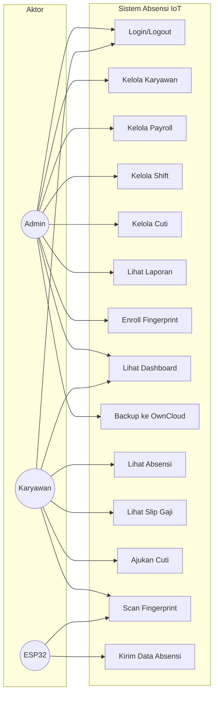

**Keterangan Aktor:**
| Aktor | Deskripsi |
|-------|-----------|
| Admin | Mengelola sistem, karyawan, payroll, dan cuti |
| Karyawan | Melakukan absensi dan melihat data pribadi |
| ESP32 | Perangkat IoT untuk scan fingerprint |

---

## 2. Activity Diagram

### 2.1 Proses Login

**Deskripsi:** Alur proses user login ke sistem.

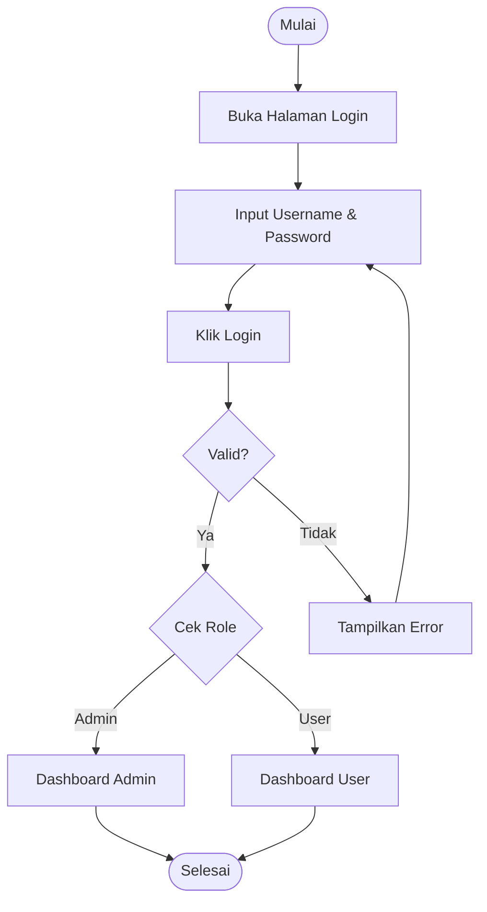

---

### 2.2 Proses Absensi Fingerprint

**Deskripsi:** Alur karyawan melakukan absensi menggunakan fingerprint.

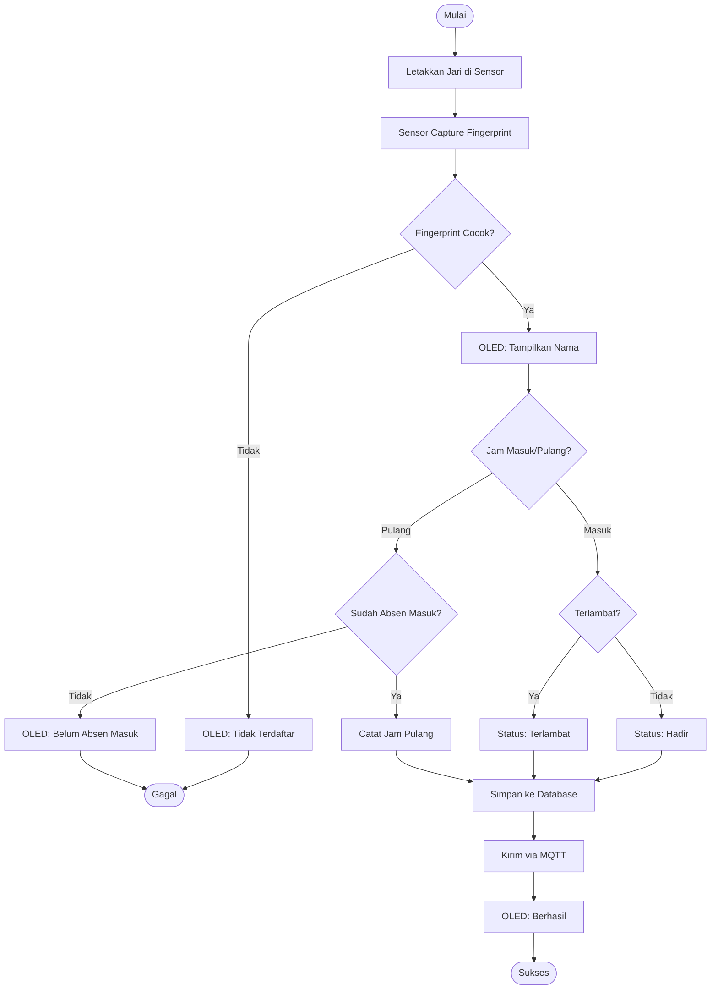

---

### 2.3 Proses Pengajuan Cuti

**Deskripsi:** Alur karyawan mengajukan cuti hingga diproses admin.

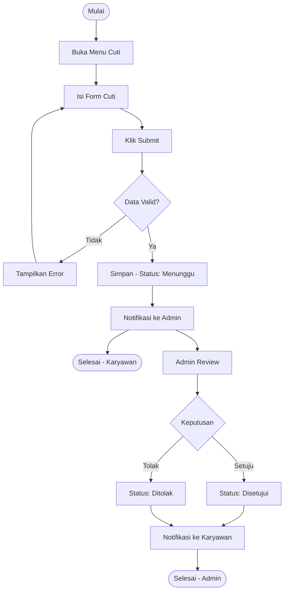

---

### 2.4 Proses Generate Payroll

**Deskripsi:** Alur admin generate payroll bulanan.

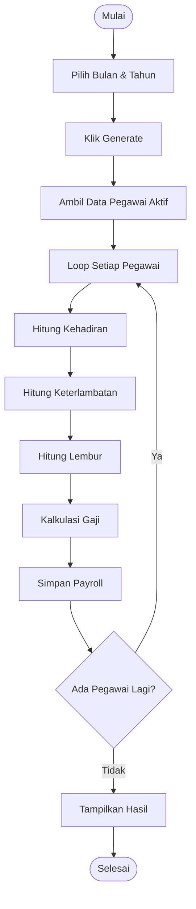

---

### 2.5 Proses Enrollment Fingerprint

**Deskripsi:** Alur pendaftaran sidik jari karyawan baru.

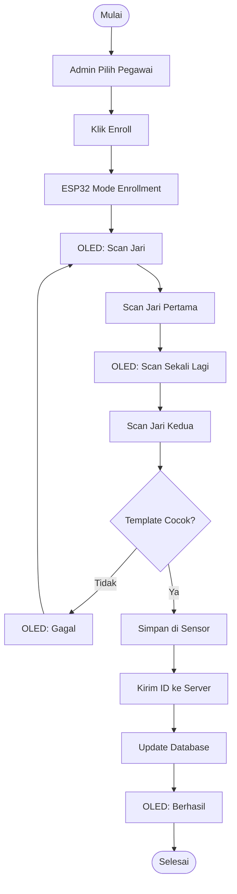

---

## 3. Sequence Diagram

### 3.1 Proses Login

**Deskripsi:** Urutan interaksi saat user login.

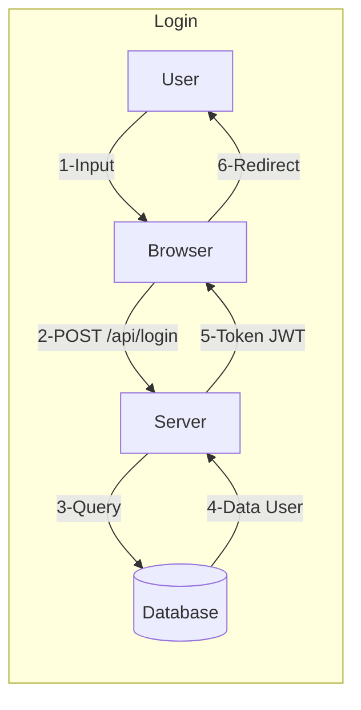

---

### 3.2 Proses Absensi Fingerprint

**Deskripsi:** Urutan interaksi saat absensi fingerprint.

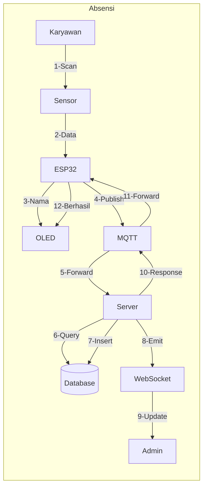

---

### 3.3 Proses Pengajuan Cuti

**Deskripsi:** Urutan interaksi pengajuan cuti.

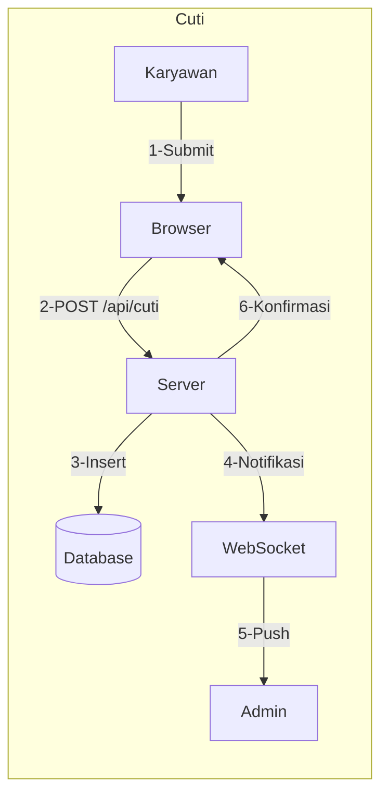

---

## 4. Class Diagram

**Deskripsi:** Struktur kelas/entitas sistem beserta atribut dan method.

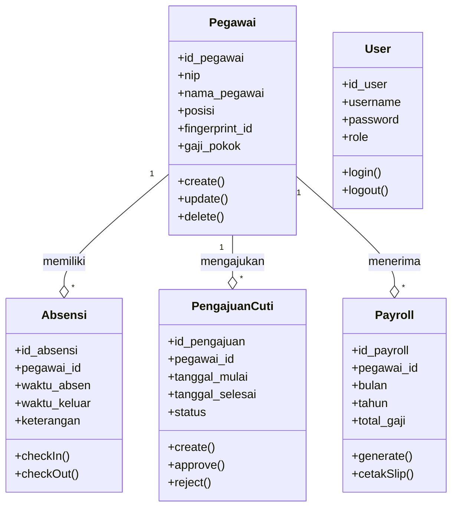

**Keterangan Relasi:**
| Relasi | Deskripsi |
|--------|-----------|
| Pegawai → Absensi | 1 pegawai punya banyak absensi |
| Pegawai → Cuti | 1 pegawai bisa ajukan banyak cuti |
| Pegawai → Payroll | 1 pegawai punya banyak record gaji |

---

## 5. Entity Relationship Diagram (ERD)

**Deskripsi:** Struktur tabel database dan relasi antar tabel.

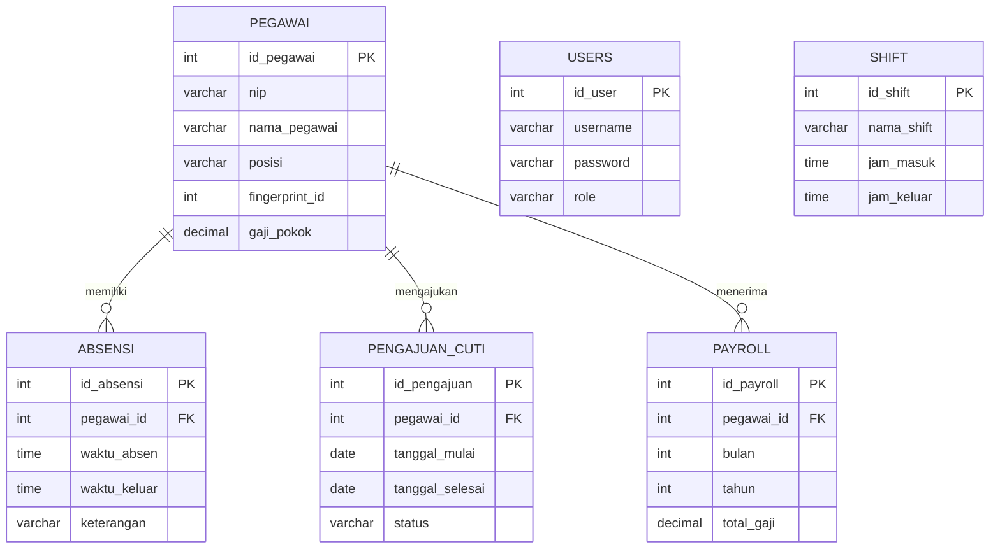

**Keterangan:**
- **PK** = Primary Key (Kunci Utama)
- **FK** = Foreign Key (Kunci Asing)
- **||--o{** = Relasi One-to-Many (1:N)

---

## 6. State Diagram

### 6.1 Status Pengajuan Cuti

**Deskripsi:** Perubahan status pengajuan cuti.

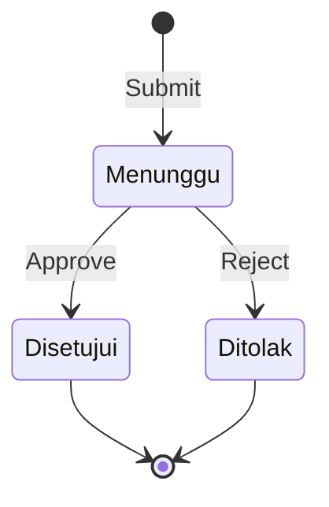

---

### 6.2 Status Absensi Harian

**Deskripsi:** Perubahan status absensi karyawan.

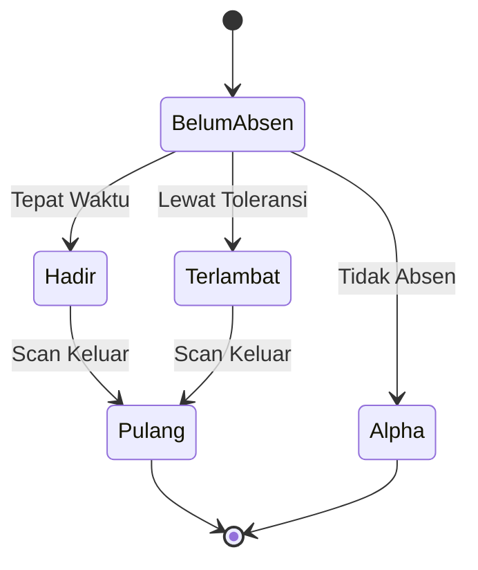

---

### 6.3 Status Pegawai

**Deskripsi:** Perubahan status kepegawaian.

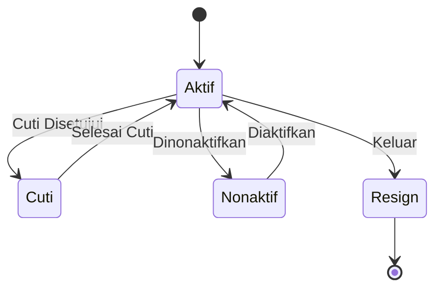

---

## 7. Component Diagram

**Deskripsi:** Komponen-komponen sistem dan keterhubungannya.

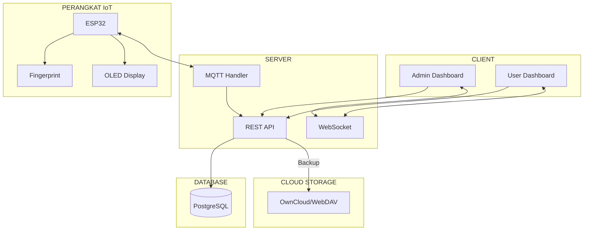

---

## 8. Deployment Diagram

**Deskripsi:** Arsitektur deployment/penempatan sistem.

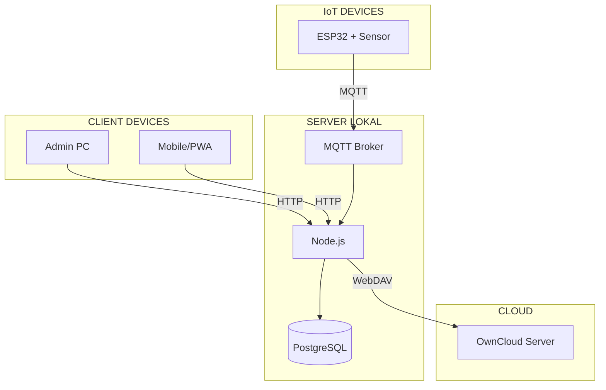

---

## 9. Arsitektur Sistem

**Deskripsi:** Gambaran keseluruhan arsitektur sistem.

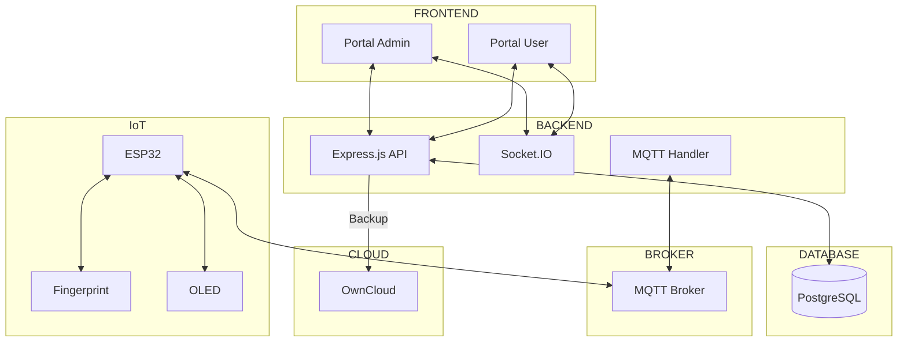

---

## Ringkasan Diagram

| No | Diagram | Fungsi |
|----|---------|--------|
| 1 | Use Case | Menunjukkan fitur yang bisa diakses setiap aktor |
| 2 | Activity | Menunjukkan alur proses/aktivitas sistem |
| 3 | Sequence | Menunjukkan urutan interaksi antar komponen |
| 4 | Class | Menunjukkan struktur kelas dan relasi |
| 5 | ERD | Menunjukkan struktur tabel database |
| 6 | State | Menunjukkan perubahan status objek |
| 7 | Component | Menunjukkan komponen sistem |
| 8 | Deployment | Menunjukkan arsitektur penempatan |
| 9 | Arsitektur | Menunjukkan gambaran keseluruhan sistem |
