# Activity Diagram

## 1. Activity Diagram Login

### 1.1 Login Admin

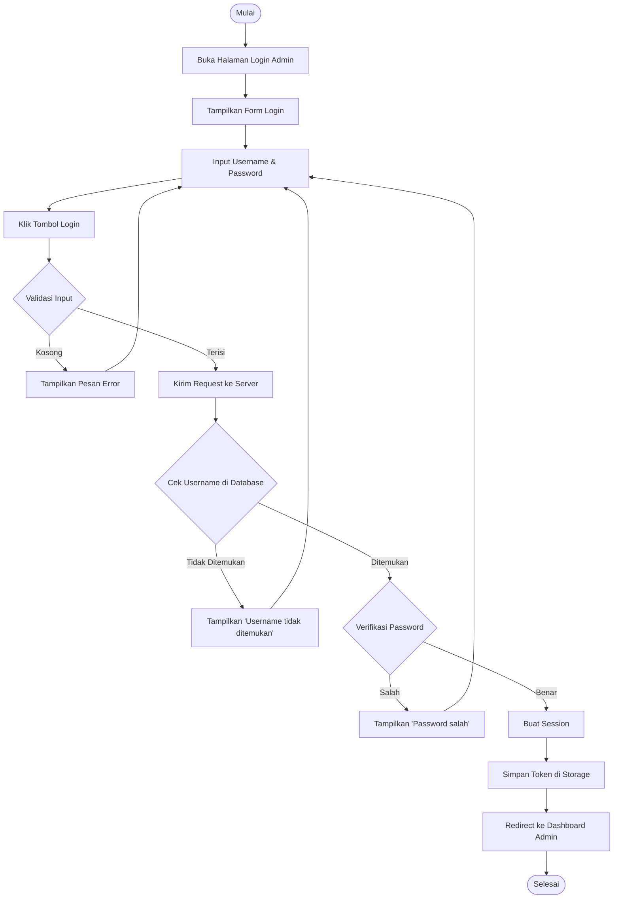

### 1.2 Login Karyawan

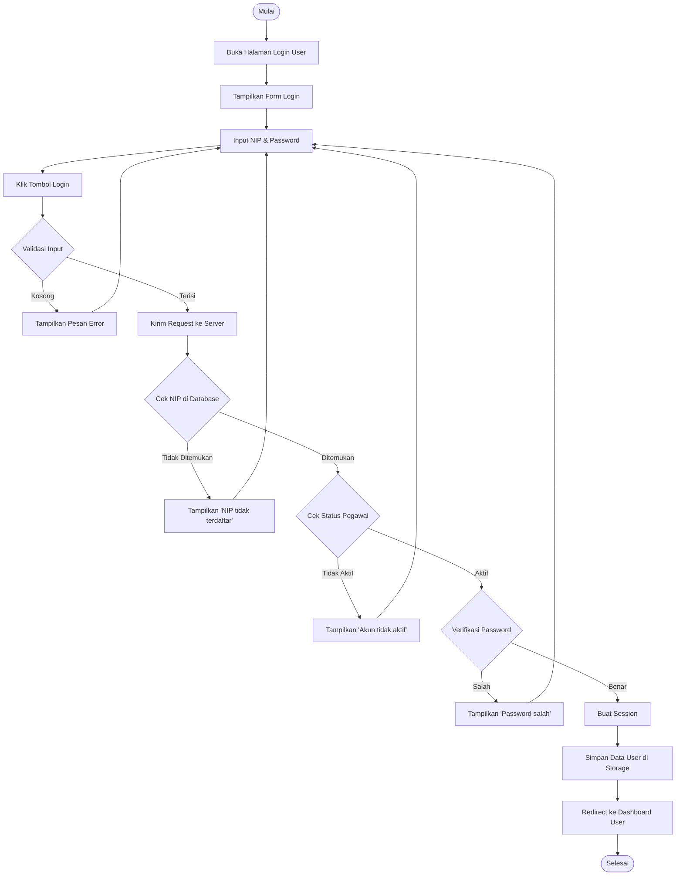

---

## 2. Activity Diagram Absensi Fingerprint

### 2.1 Absensi Masuk

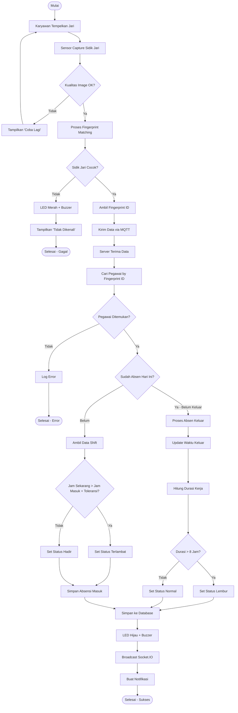

### 2.2 Flowchart Sederhana Absensi

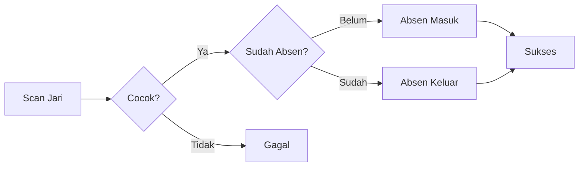

---

## 3. Activity Diagram Enrollment Fingerprint

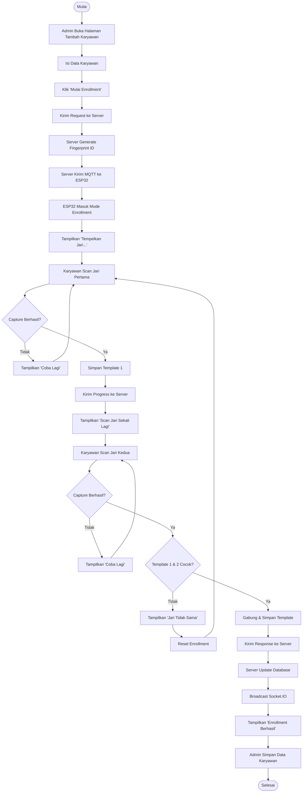

---

## 4. Activity Diagram Pengajuan Cuti

### 4.1 Karyawan Mengajukan Cuti

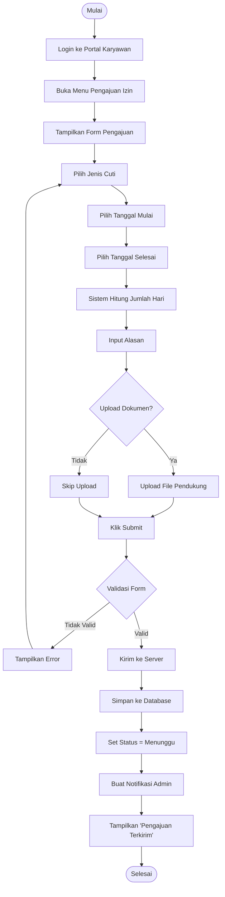

### 4.2 Admin Approval Cuti

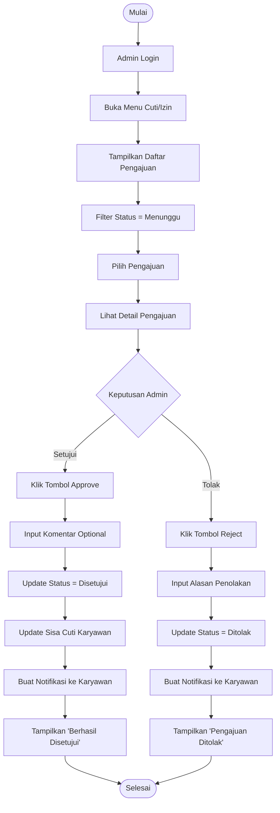

---

## 5. Activity Diagram Generate Payroll

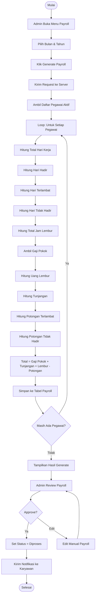

---

## 6. Activity Diagram Kelola Karyawan

### 6.1 Tambah Karyawan

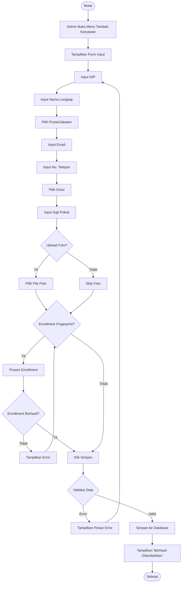

### 6.2 Edit Karyawan

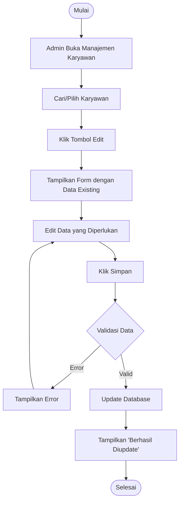

### 6.3 Hapus Karyawan

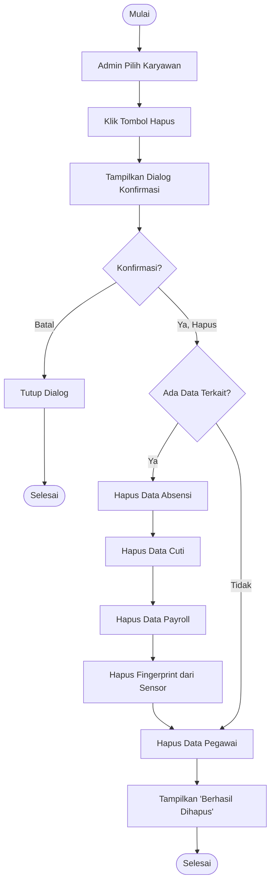

---

## 7. Activity Diagram Lihat Laporan

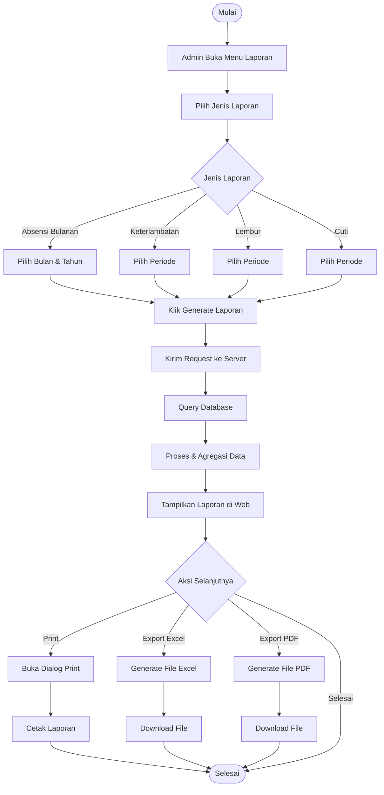

---

## 8. Activity Diagram Backup OwnCloud

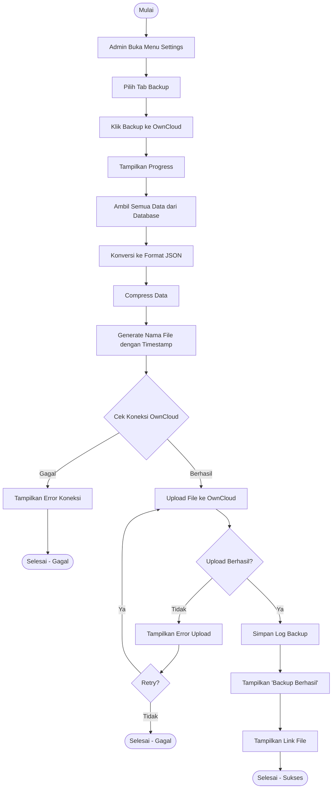

---

## 9. Activity Diagram Notifikasi Real-time

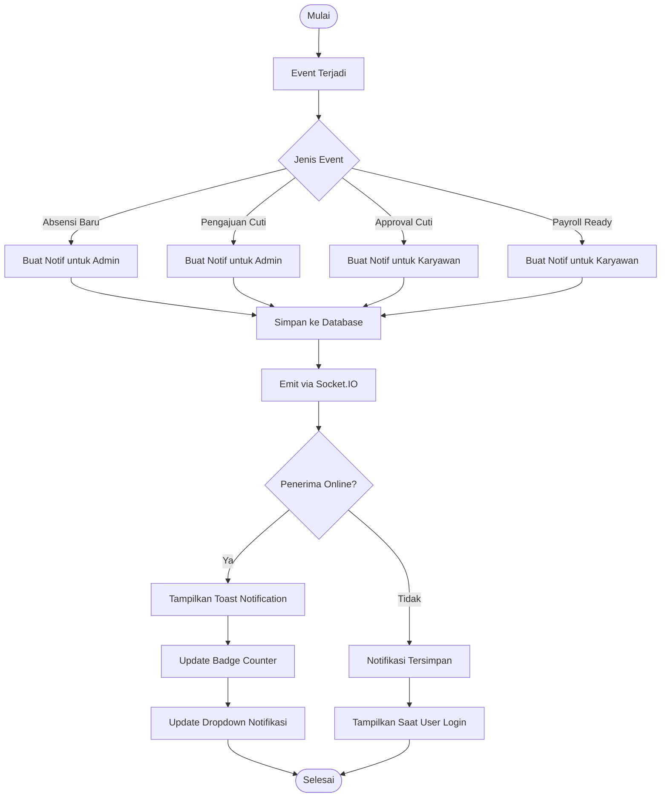

---

## 10. Ringkasan Activity Diagram

| No | Activity Diagram | Aktor | Deskripsi |
|----|------------------|-------|-----------|
| 1 | Login Admin | Admin | Proses autentikasi admin |
| 2 | Login Karyawan | Karyawan | Proses autentikasi karyawan |
| 3 | Absensi Masuk | Karyawan, ESP32 | Proses clock-in via fingerprint |
| 4 | Enrollment Fingerprint | Admin, Karyawan, ESP32 | Pendaftaran sidik jari baru |
| 5 | Pengajuan Cuti | Karyawan | Mengajukan cuti/izin |
| 6 | Approval Cuti | Admin | Menyetujui/menolak cuti |
| 7 | Generate Payroll | Admin | Membuat data penggajian |
| 8 | Tambah Karyawan | Admin | Menambah data karyawan baru |
| 9 | Edit Karyawan | Admin | Mengubah data karyawan |
| 10 | Hapus Karyawan | Admin | Menghapus data karyawan |
| 11 | Lihat Laporan | Admin | Melihat dan export laporan |
| 12 | Backup OwnCloud | Admin | Backup data ke cloud |
| 13 | Notifikasi | Sistem | Pengiriman notifikasi real-time |

---

*Dokumentasi Activity Diagram - Sistem Absensi IoT Berbasis Fingerprint*
