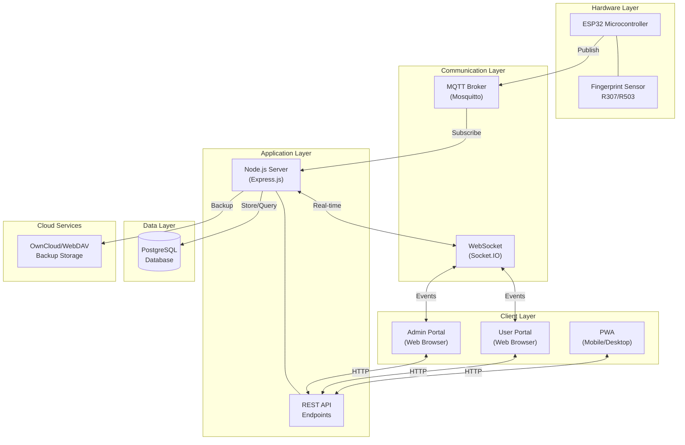
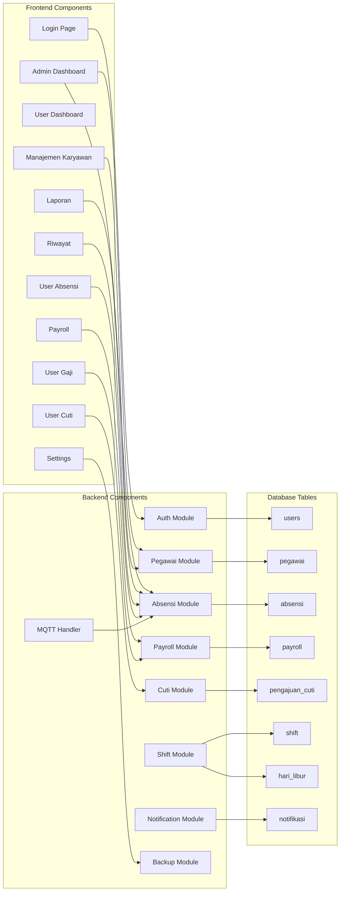
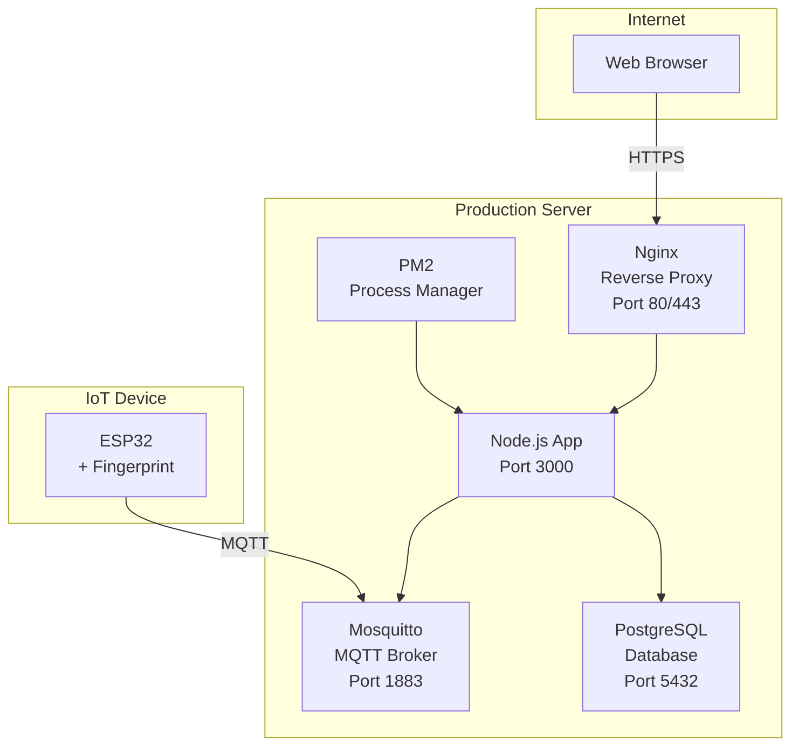
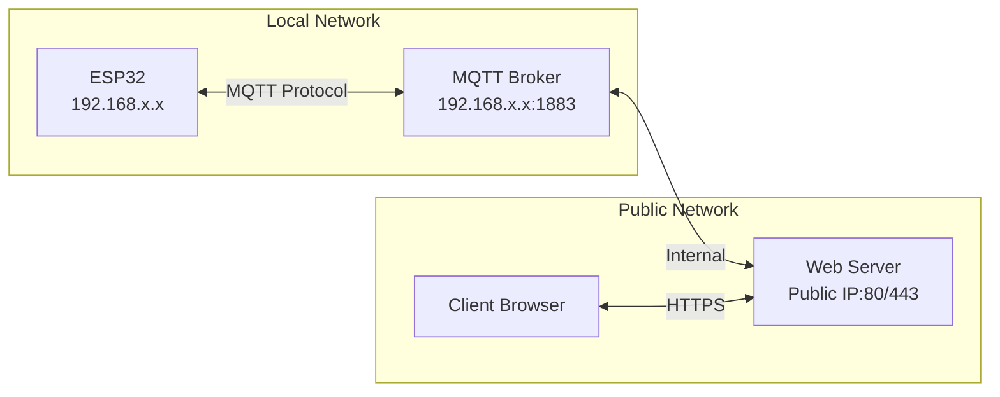
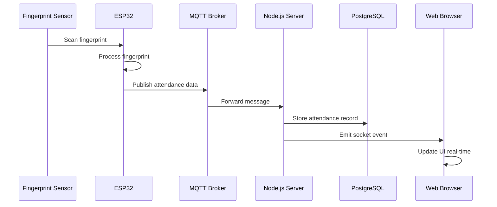

# Diagram Arsitektur Sistem

## 1. Arsitektur Keseluruhan



## 2. Diagram Komponen



## 3. Diagram Deployment



## 4. Diagram Network



## 5. Aliran Data



## 6. Layer Architecture

```
┌────────────────────────────────────────────────────────┐
│                   PRESENTATION LAYER                    │
│  ┌──────────────┐  ┌──────────────┐  ┌──────────────┐  │
│  │ Admin Portal │  │ User Portal  │  │  PWA Client  │  │
│  │  (HTML/CSS/  │  │  (HTML/CSS/  │  │  (Service    │  │
│  │   JS)        │  │   JS)        │  │   Worker)    │  │
│  └──────────────┘  └──────────────┘  └──────────────┘  │
└────────────────────────────────────────────────────────┘
                           │
                           ▼
┌────────────────────────────────────────────────────────┐
│                    APPLICATION LAYER                    │
│  ┌──────────────────────────────────────────────────┐  │
│  │              Node.js + Express.js                │  │
│  │  ┌─────────┐ ┌─────────┐ ┌─────────┐ ┌────────┐  │  │
│  │  │  Auth   │ │ Pegawai │ │ Absensi │ │Payroll │  │  │
│  │  │ Module  │ │ Module  │ │ Module  │ │ Module │  │  │
│  │  └─────────┘ └─────────┘ └─────────┘ └────────┘  │  │
│  │  ┌─────────┐ ┌─────────┐ ┌─────────┐            │  │
│  │  │  Cuti   │ │  Shift  │ │  MQTT   │            │  │
│  │  │ Module  │ │ Module  │ │ Handler │            │  │
│  │  └─────────┘ └─────────┘ └─────────┘            │  │
│  └──────────────────────────────────────────────────┘  │
└────────────────────────────────────────────────────────┘
                           │
                           ▼
┌────────────────────────────────────────────────────────┐
│                      DATA LAYER                         │
│  ┌──────────────────────────────────────────────────┐  │
│  │                   PostgreSQL                      │  │
│  │  ┌────────┐ ┌────────┐ ┌────────┐ ┌────────────┐ │  │
│  │  │ users  │ │pegawai │ │absensi │ │  payroll   │ │  │
│  │  └────────┘ └────────┘ └────────┘ └────────────┘ │  │
│  │  ┌────────┐ ┌────────┐ ┌────────┐ ┌────────────┐ │  │
│  │  │  cuti  │ │ shift  │ │ libur  │ │ notifikasi │ │  │
│  │  └────────┘ └────────┘ └────────┘ └────────────┘ │  │
│  └──────────────────────────────────────────────────┘  │
└────────────────────────────────────────────────────────┘
                           │
                           ▼
┌────────────────────────────────────────────────────────┐
│                   HARDWARE LAYER                        │
│  ┌──────────────────────────────────────────────────┐  │
│  │         ESP32 + Fingerprint Sensor R307          │  │
│  │  ┌─────────────┐  ┌─────────────┐                │  │
│  │  │ WiFi Module │  │MQTT Client  │                │  │
│  │  └─────────────┘  └─────────────┘                │  │
│  └──────────────────────────────────────────────────┘  │
└────────────────────────────────────────────────────────┘
```

## 7. Technology Stack

| Layer | Technology | Purpose |
|-------|------------|---------|
| Frontend | HTML5, CSS3, JavaScript | User Interface |
| UI Framework | Glassmorphism CSS | Modern UI Design |
| PWA | Service Worker, Manifest | Offline Support |
| Backend | Node.js v16+ | Server Runtime |
| Framework | Express.js | Web Framework |
| Real-time | Socket.IO | WebSocket Communication |
| Database | PostgreSQL 13+ | Data Storage |
| IoT Protocol | MQTT | Device Communication |
| MQTT Broker | Mosquitto | Message Broker |
| Hardware | ESP32 | Microcontroller |
| Sensor | R307/R503 | Fingerprint Reader |
| Cloud | OwnCloud/WebDAV | Backup Storage |
