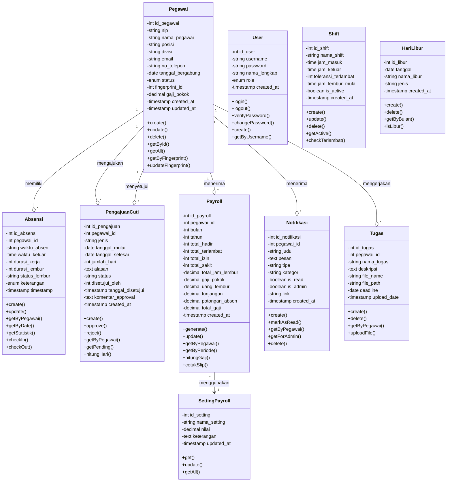
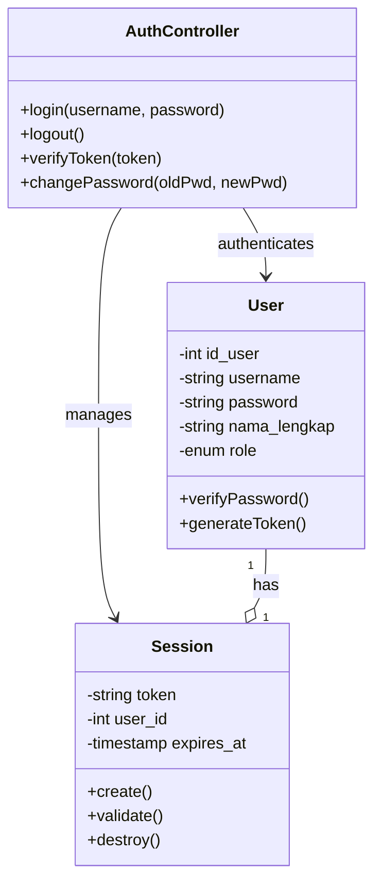
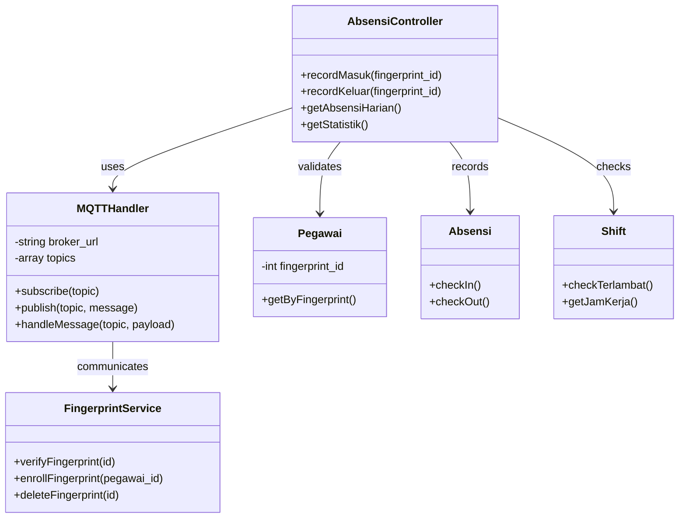
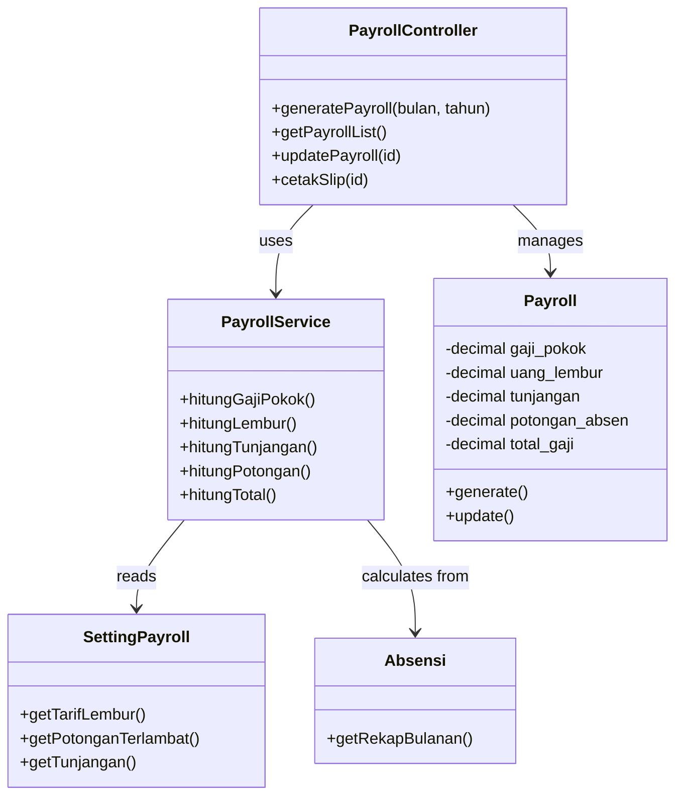
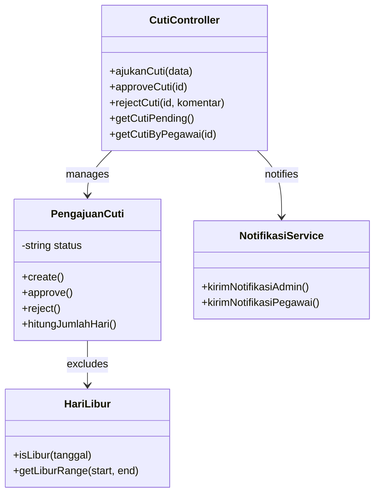
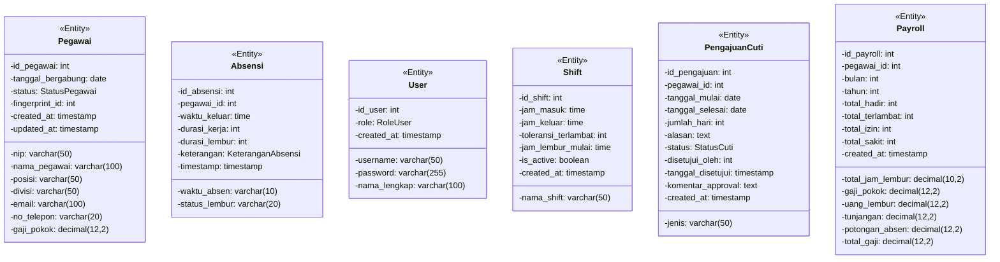
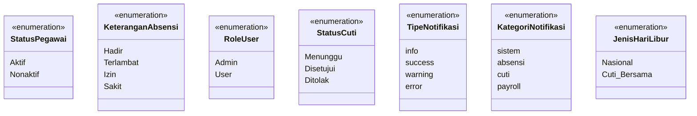
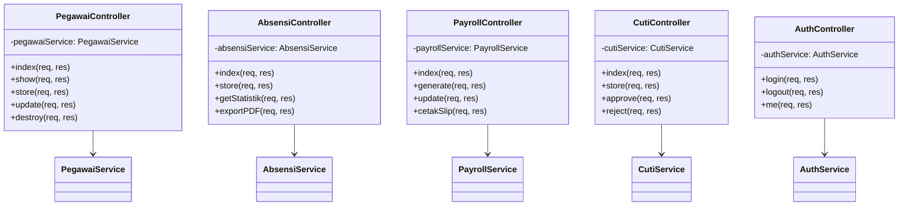
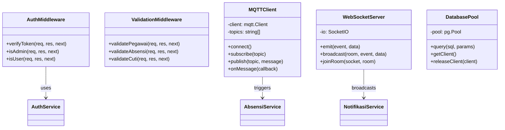

# Class Diagram

## 1. Class Diagram Sistem Absensi IoT

### 1.1 Class Diagram Keseluruhan

---

### 1.2 Class Diagram per Module

#### A. Module Autentikasi

#### B. Module Absensi IoT

#### C. Module Payroll

#### D. Module Cuti

---

## 2. Class Diagram dengan Atribut Lengkap

### 2.1 Entity Classes

### 2.2 Enumeration Classes

---

## 3. Service Classes

```mermaid
classDiagram
    class PegawaiService {
        +create(data): Pegawai
        +update(id, data): Pegawai
        +delete(id): boolean
        +getById(id): Pegawai
        +getAll(): Pegawai[]
        +getByFingerprint(fp_id): Pegawai
        +search(keyword): Pegawai[]
    }

    class AbsensiService {
        +recordMasuk(pegawai_id, waktu): Absensi
        +recordKeluar(pegawai_id, waktu): Absensi
        +getByPegawai(pegawai_id): Absensi[]
        +getByTanggal(tanggal): Absensi[]
        +getStatistik(pegawai_id, bulan, tahun): object
        +checkTerlambat(waktu, shift): boolean
    }

    class PayrollService {
        +generate(bulan, tahun): Payroll[]
        +generateForPegawai(pegawai_id, bulan, tahun): Payroll
        +hitungGaji(absensi, setting): object
        +cetakSlip(payroll_id): PDF
    }

    class CutiService {
        +ajukan(data): PengajuanCuti
        +approve(id, admin_id): PengajuanCuti
        +reject(id, admin_id, komentar): PengajuanCuti
        +hitungHariKerja(mulai, selesai): int
        +getPending(): PengajuanCuti[]
    }

    class NotifikasiService {
        +create(data): Notifikasi
        +markAsRead(id): boolean
        +getUnread(pegawai_id): Notifikasi[]
        +broadcast(pesan): boolean
    }

    class AuthService {
        +login(username, password): Token
        +logout(token): boolean
        +verifyToken(token): User
        +hashPassword(password): string
    }
```

---

## 4. Controller Classes

---

## 5. Middleware & Utility Classes

---

## 6. Tabel Ringkasan Class

| Class | Tipe | Deskripsi | Relasi |
|-------|------|-----------|--------|
| Pegawai | Entity | Data master karyawan | 1:N dengan Absensi, Payroll, Cuti, Tugas |
| Absensi | Entity | Record kehadiran harian | N:1 dengan Pegawai |
| User | Entity | Akun login sistem | - |
| Shift | Entity | Konfigurasi jam kerja | - |
| PengajuanCuti | Entity | Pengajuan cuti/izin | N:1 dengan Pegawai |
| Payroll | Entity | Data penggajian bulanan | N:1 dengan Pegawai |
| HariLibur | Entity | Kalender hari libur | - |
| Notifikasi | Entity | Notifikasi sistem | N:1 dengan Pegawai |
| Tugas | Entity | Upload file tugas | N:1 dengan Pegawai |
| SettingPayroll | Entity | Konfigurasi payroll | - |
| PegawaiService | Service | Business logic pegawai | - |
| AbsensiService | Service | Business logic absensi | - |
| PayrollService | Service | Business logic payroll | - |
| AuthService | Service | Business logic autentikasi | - |
| MQTTClient | Utility | Koneksi ke MQTT broker | - |
| WebSocketServer | Utility | Real-time communication | - |

---

*Dokumentasi Class Diagram - Sistem Absensi IoT Berbasis Fingerprint*
