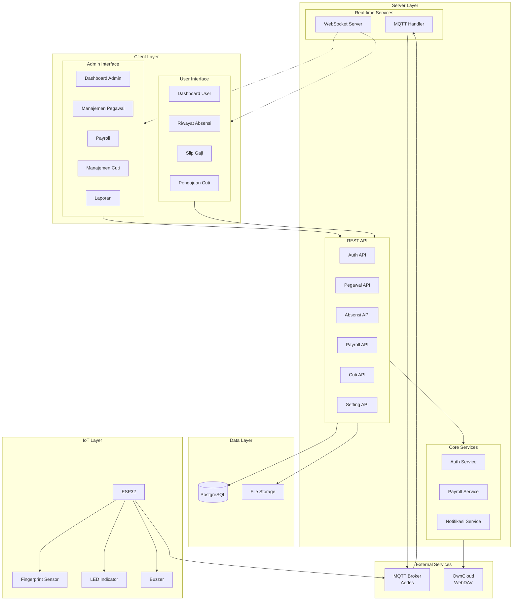

# Component Diagram

## 1. Component Diagram Keseluruhan Sistem



---

## 2. Component Diagram Detail - Server Components

```mermaid
flowchart TB
    subgraph ExpressServer["Express.js Server"]
        subgraph Middleware["Middleware Layer"]
            CORS[CORS]
            BodyParser[Body Parser]
            Auth[Auth Middleware]
            CSRF[CSRF Protection]
            RateLimit[Rate Limiter]
        end

        subgraph Routes["Route Layer"]
            AuthRoute[/api/auth/*]
            PegawaiRoute[/api/pegawai/*]
            AbsensiRoute[/api/absensi/*]
            PayrollRoute[/api/payroll/*]
            CutiRoute[/api/cuti/*]
            ShiftRoute[/api/shift/*]
            NotifRoute[/api/notifikasi/*]
            SettingRoute[/api/setting/*]
            BackupRoute[/api/backup/*]
        end

        subgraph Controllers["Controller Layer"]
            AuthCtrl[AuthController]
            PegawaiCtrl[PegawaiController]
            AbsensiCtrl[AbsensiController]
            PayrollCtrl[PayrollController]
            CutiCtrl[CutiController]
        end

        subgraph Services["Service Layer"]
            AuthSvc[AuthService]
            PayrollSvc[PayrollService]
            NotifSvc[NotifikasiService]
            BackupSvc[BackupService]
        end
    end

    subgraph Database["Database Layer"]
        Pool[Connection Pool]
        PG[(PostgreSQL)]
    end

    subgraph RealTime["Real-time Layer"]
        SocketIO[Socket.IO]
        Aedes[Aedes MQTT]
    end

    %% Flow
    Middleware --> Routes
    Routes --> Controllers
    Controllers --> Services
    Services --> Pool
    Pool --> PG

    Controllers --> SocketIO
    Aedes --> Controllers
```

---

## 3. Component Diagram - Frontend Components


---

## 4. Component Diagram - IoT Components


---

## 5. Component Diagram - Database Components


---

## 6. Component Diagram - API Endpoints


---

## 7. Component Diagram - Communication Flow


---

## 8. Tabel Deskripsi Komponen

### 8.1 Client Components

| Komponen | Teknologi | Deskripsi | Port |
|----------|-----------|-----------|------|
| Admin Dashboard | HTML/CSS/JS | Interface untuk admin | 80/443 |
| User Dashboard | HTML/CSS/JS | Interface untuk karyawan | 80/443 |
| PWA Service Worker | JavaScript | Offline capability | - |
| Socket.IO Client | JavaScript | Real-time updates | 3000 |

### 8.2 Server Components

| Komponen | Teknologi | Deskripsi | Port |
|----------|-----------|-----------|------|
| Express.js | Node.js | Web server & REST API | 3000 |
| Socket.IO Server | Node.js | WebSocket server | 3000 |
| Aedes | Node.js | MQTT broker | 1883 |
| pg Pool | Node.js | Database connection pool | - |

### 8.3 Data Components

| Komponen | Teknologi | Deskripsi | Port |
|----------|-----------|-----------|------|
| PostgreSQL | PostgreSQL 14+ | Relational database | 5432 |
| File Storage | File System | Upload storage | - |
| OwnCloud | WebDAV | Backup storage | 443 |

### 8.4 IoT Components

| Komponen | Teknologi | Deskripsi | Koneksi |
|----------|-----------|-----------|---------|
| ESP32 | Arduino/C++ | Microcontroller | WiFi |
| AS608 | Hardware | Fingerprint sensor | Serial |
| OLED Display | Hardware | Status display | I2C |
| LED/Buzzer | Hardware | Indicator | GPIO |

---

## 9. Interface Description

### 9.1 REST API Interface

```
┌─────────────────────────────────────────────────────────────┐
│                    REST API Interface                        │
├─────────────────────────────────────────────────────────────┤
│ Base URL: http://localhost:3000/api                         │
│ Content-Type: application/json                              │
│ Authentication: Bearer Token (JWT)                          │
├─────────────────────────────────────────────────────────────┤
│ Headers:                                                    │
│   Authorization: Bearer <token>                             │
│   Content-Type: application/json                            │
│   X-CSRF-Token: <csrf_token>                               │
├─────────────────────────────────────────────────────────────┤
│ Response Format:                                            │
│   Success: { success: true, data: {...} }                   │
│   Error: { success: false, error: "message" }               │
└─────────────────────────────────────────────────────────────┘
```

### 9.2 WebSocket Interface

```
┌─────────────────────────────────────────────────────────────┐
│                 WebSocket Interface                          │
├─────────────────────────────────────────────────────────────┤
│ URL: ws://localhost:3000                                    │
│ Protocol: Socket.IO                                         │
├─────────────────────────────────────────────────────────────┤
│ Events (Server → Client):                                   │
│   - attendance-new: New attendance record                   │
│   - attendance-update: Updated attendance                   │
│   - notification: New notification                          │
│   - cuti-status: Leave status change                        │
├─────────────────────────────────────────────────────────────┤
│ Events (Client → Server):                                   │
│   - join-room: Join specific room                           │
│   - leave-room: Leave room                                  │
└─────────────────────────────────────────────────────────────┘
```

### 9.3 MQTT Interface

```
┌─────────────────────────────────────────────────────────────┐
│                    MQTT Interface                            │
├─────────────────────────────────────────────────────────────┤
│ Broker: mqtt://localhost:1883                               │
│ Protocol: MQTT 3.1.1                                        │
├─────────────────────────────────────────────────────────────┤
│ Topics:                                                     │
│   fingerprint/attendance    - Attendance data (ESP→Server)  │
│   fingerprint/enroll/request - Start enrollment (Server→ESP)│
│   fingerprint/enroll/response - Enrollment result (ESP→Srv) │
│   fingerprint/enroll/progress - Enrollment progress         │
│   fingerprint/status        - Device status                 │
├─────────────────────────────────────────────────────────────┤
│ Payload Format: JSON                                        │
│   { fingerprint_id: int, timestamp: ISO8601, type: string } │
└─────────────────────────────────────────────────────────────┘
```

---

*Dokumentasi Component Diagram - Sistem Absensi IoT Berbasis Fingerprint*
