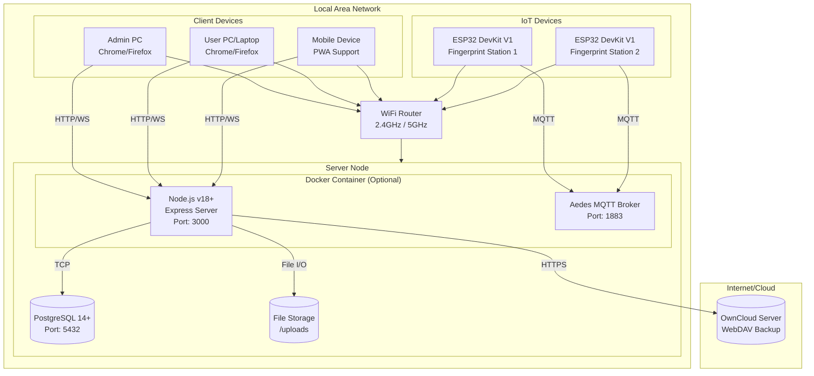
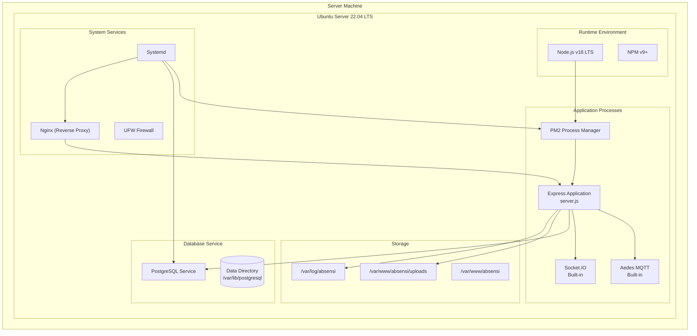
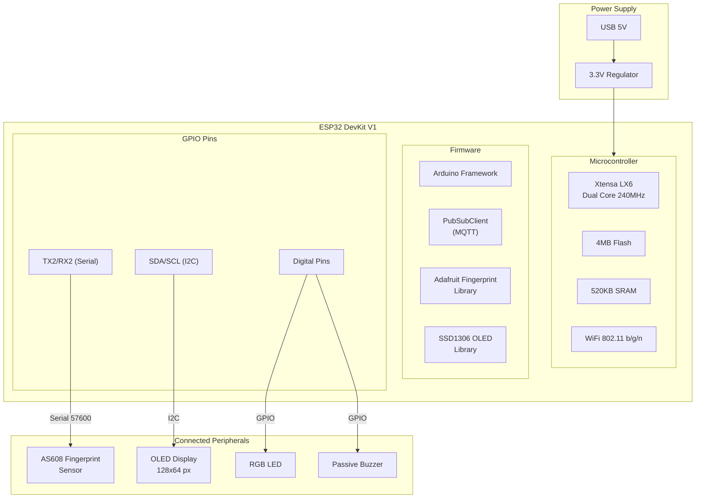
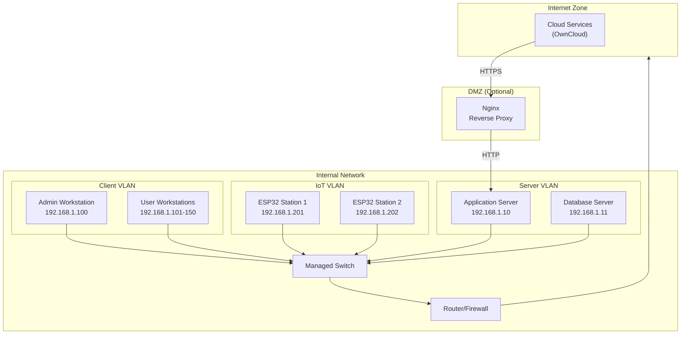
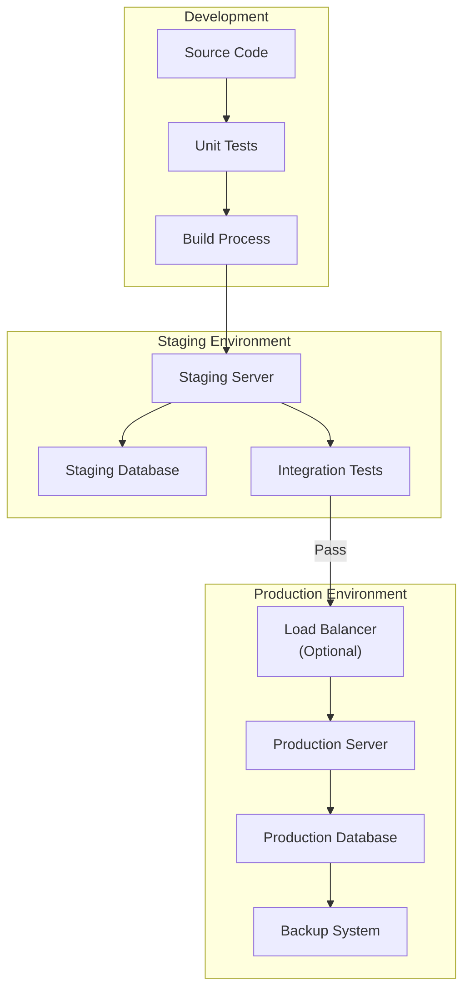
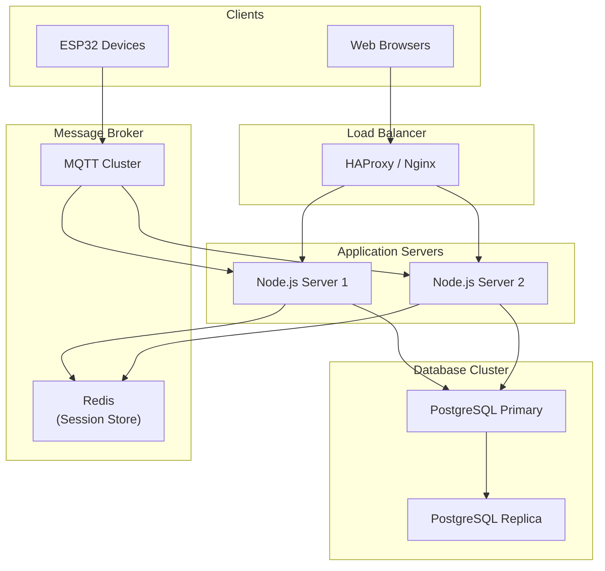
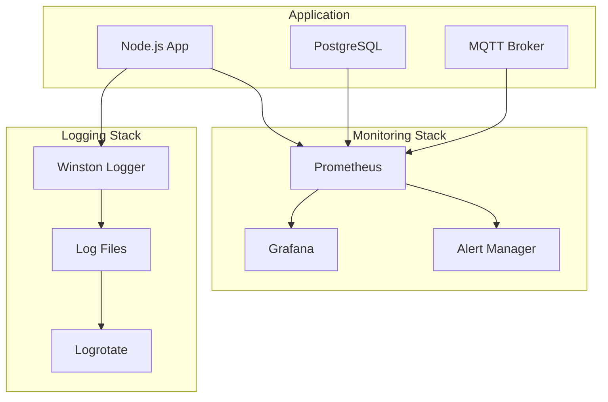

# Deployment Diagram

## 1. Deployment Diagram Keseluruhan



---

## 2. Deployment Diagram - Physical View

```
┌─────────────────────────────────────────────────────────────────────────────┐
│                          DEPLOYMENT ARCHITECTURE                              │
│                    Sistem Absensi IoT Berbasis Fingerprint                   │
└─────────────────────────────────────────────────────────────────────────────┘

                                   ┌─────────────────┐
                                   │   INTERNET      │
                                   │                 │
                                   │  ┌───────────┐  │
                                   │  │ OwnCloud  │  │
                                   │  │  Server   │  │
                                   │  │ (Backup)  │  │
                                   │  └───────────┘  │
                                   └────────┬────────┘
                                            │ HTTPS
                                            │
┌───────────────────────────────────────────┼─────────────────────────────────┐
│                              LOCAL NETWORK │                                 │
│                                           │                                 │
│   ┌─────────────────────────────────────────────────────────────────────┐   │
│   │                        SERVER NODE                                   │   │
│   │   ┌──────────────────────────────────────────────────────────────┐  │   │
│   │   │                    APPLICATION SERVER                         │  │   │
│   │   │                                                               │  │   │
│   │   │   ┌─────────────────┐     ┌─────────────────┐                │  │   │
│   │   │   │   Node.js       │     │  Aedes MQTT     │                │  │   │
│   │   │   │   Express.js    │     │    Broker       │                │  │   │
│   │   │   │   Socket.IO     │     │                 │                │  │   │
│   │   │   │   Port: 3000    │     │   Port: 1883    │                │  │   │
│   │   │   └────────┬────────┘     └────────┬────────┘                │  │   │
│   │   │            │                       │                          │  │   │
│   │   └────────────┼───────────────────────┼──────────────────────────┘  │   │
│   │                │                       │                              │   │
│   │   ┌────────────┴───────────┐   ┌───────┴───────────┐                 │   │
│   │   │    PostgreSQL DB       │   │   File Storage    │                 │   │
│   │   │    Port: 5432          │   │   /uploads        │                 │   │
│   │   │    - pegawai           │   │   - photos        │                 │   │
│   │   │    - absensi           │   │   - documents     │                 │   │
│   │   │    - payroll           │   │   - backups       │                 │   │
│   │   │    - dll               │   │                   │                 │   │
│   │   └────────────────────────┘   └───────────────────┘                 │   │
│   └──────────────────────────────────────────────────────────────────────┘   │
│                                    │                                         │
│                           ┌────────┴────────┐                               │
│                           │   WiFi Router   │                               │
│                           │   192.168.x.x   │                               │
│                           └────────┬────────┘                               │
│                                    │                                         │
│        ┌──────────────────┬────────┴────────┬──────────────────┐           │
│        │                  │                  │                  │           │
│   ┌────┴────┐       ┌────┴────┐       ┌────┴────┐       ┌────┴────┐       │
│   │Admin PC │       │ User PC │       │ Mobile  │       │  ESP32  │       │
│   │ Browser │       │ Browser │       │   PWA   │       │ Station │       │
│   │         │       │         │       │         │       │         │       │
│   │ Chrome/ │       │ Chrome/ │       │ Android/│       │  WiFi   │       │
│   │ Firefox │       │ Firefox │       │   iOS   │       │  MQTT   │       │
│   └─────────┘       └─────────┘       └─────────┘       └─────────┘       │
│                                                                             │
└─────────────────────────────────────────────────────────────────────────────┘
```

---

## 3. Deployment Diagram - Server Detail



---

## 4. Deployment Diagram - ESP32 Device



---

## 5. Network Topology



---

## 6. Deployment Configuration

### 6.1 Server Requirements

| Komponen | Minimum | Recommended |
|----------|---------|-------------|
| CPU | 2 Core | 4 Core |
| RAM | 4 GB | 8 GB |
| Storage | 50 GB SSD | 100 GB SSD |
| OS | Ubuntu 20.04+ | Ubuntu 22.04 LTS |
| Network | 100 Mbps | 1 Gbps |

### 6.2 Software Stack

| Layer | Software | Version |
|-------|----------|---------|
| OS | Ubuntu Server | 22.04 LTS |
| Runtime | Node.js | 18.x LTS |
| Database | PostgreSQL | 14+ |
| Web Server | Nginx | 1.18+ |
| Process Manager | PM2 | 5.x |
| SSL | Let's Encrypt | - |

### 6.3 Port Configuration

| Service | Port | Protocol | Access |
|---------|------|----------|--------|
| HTTP | 80 | TCP | Public |
| HTTPS | 443 | TCP | Public |
| Node.js App | 3000 | TCP | Internal |
| PostgreSQL | 5432 | TCP | Internal |
| MQTT | 1883 | TCP | Internal |
| MQTT SSL | 8883 | TCP | Internal |
| Socket.IO | 3000 | TCP/WS | Internal |

### 6.4 ESP32 Requirements

| Komponen | Spesifikasi |
|----------|-------------|
| Board | ESP32 DevKit V1 |
| Flash | 4 MB minimum |
| WiFi | 2.4 GHz b/g/n |
| Power | 5V USB / 3.3V |
| Fingerprint | AS608 / R307 |
| Display | OLED SSD1306 128x64 |

---

## 7. Deployment Process



---

## 8. High Availability Setup (Optional)



---

## 9. Monitoring & Logging



---

## 10. Security Configuration

### 10.1 Firewall Rules (UFW)

```bash
# Default policies
ufw default deny incoming
ufw default allow outgoing

# Allow SSH
ufw allow 22/tcp

# Allow HTTP/HTTPS
ufw allow 80/tcp
ufw allow 443/tcp

# Allow MQTT (internal only)
ufw allow from 192.168.1.0/24 to any port 1883

# Allow PostgreSQL (internal only)
ufw allow from 192.168.1.10 to any port 5432
```

### 10.2 SSL/TLS Configuration

| Service | Certificate | Protocol |
|---------|-------------|----------|
| HTTPS | Let's Encrypt | TLS 1.3 |
| MQTT SSL | Self-signed | TLS 1.2 |
| PostgreSQL | Self-signed | TLS 1.2 |

---

*Dokumentasi Deployment Diagram - Sistem Absensi IoT Berbasis Fingerprint*
