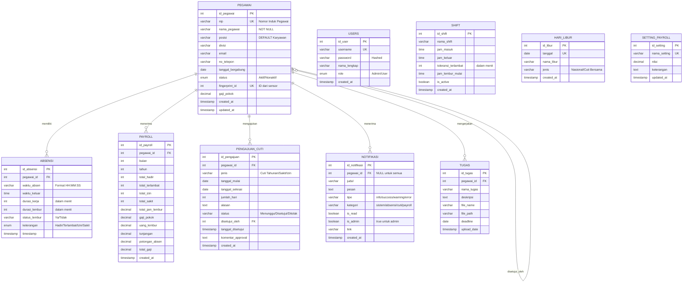

# Entity Relationship Diagram (ERD)

## 1. ERD Sistem Absensi IoT

### 1.1 ERD Diagram (Mermaid)



---

### 1.2 ERD Diagram (Visual)

```
┌─────────────────────────────────────────────────────────────────────────────────┐
│                         ENTITY RELATIONSHIP DIAGRAM                              │
│                      Sistem Absensi IoT Berbasis Fingerprint                     │
└─────────────────────────────────────────────────────────────────────────────────┘

┌─────────────────┐         ┌─────────────────┐         ┌─────────────────┐
│     USERS       │         │     SHIFT       │         │   HARI_LIBUR    │
├─────────────────┤         ├─────────────────┤         ├─────────────────┤
│ id_user      PK │         │ id_shift     PK │         │ id_libur     PK │
│ username     UK │         │ nama_shift      │         │ tanggal      UK │
│ password        │         │ jam_masuk       │         │ nama_libur      │
│ nama_lengkap    │         │ jam_keluar      │         │ jenis           │
│ role            │         │ toleransi       │         │ created_at      │
│ created_at      │         │ jam_lembur      │         └─────────────────┘
└─────────────────┘         │ is_active       │
                            │ created_at      │
                            └─────────────────┘

                            ┌─────────────────┐
                            │    PEGAWAI      │
                            ├─────────────────┤
                            │ id_pegawai   PK │
                            │ nip          UK │
                            │ nama_pegawai    │
                            │ posisi          │
                            │ divisi          │
                            │ email           │
                            │ no_telepon      │
                            │ tanggal_bergabung│
                            │ status          │
                            │ fingerprint_id UK│
                            │ gaji_pokok      │
                            │ created_at      │
                            │ updated_at      │
                            └────────┬────────┘
                                     │
           ┌─────────────────────────┼─────────────────────────┐
           │              │          │          │              │
           ▼              ▼          ▼          ▼              ▼
┌─────────────────┐ ┌─────────────┐ ┌─────────────┐ ┌─────────────────┐
│    ABSENSI      │ │   PAYROLL   │ │   TUGAS     │ │PENGAJUAN_CUTI   │
├─────────────────┤ ├─────────────┤ ├─────────────┤ ├─────────────────┤
│ id_absensi   PK │ │id_payroll PK│ │ id_tugas PK │ │ id_pengajuan PK │
│ pegawai_id   FK │ │pegawai_id FK│ │pegawai_id FK│ │ pegawai_id   FK │
│ waktu_absen     │ │ bulan       │ │ nama_tugas  │ │ jenis           │
│ waktu_keluar    │ │ tahun       │ │ deskripsi   │ │ tanggal_mulai   │
│ durasi_kerja    │ │ total_hadir │ │ file_name   │ │ tanggal_selesai │
│ durasi_lembur   │ │total_terlmbt│ │ file_path   │ │ jumlah_hari     │
│ status_lembur   │ │ total_izin  │ │ deadline    │ │ alasan          │
│ keterangan      │ │ total_sakit │ │ upload_date │ │ status          │
│ timestamp       │ │ jam_lembur  │ └─────────────┘ │ disetujui_oleh  │
└─────────────────┘ │ gaji_pokok  │                 │ tgl_disetujui   │
                    │ uang_lembur │                 │ komentar        │
                    │ tunjangan   │                 │ created_at      │
                    │ potongan    │                 └─────────────────┘
                    │ total_gaji  │
                    │ created_at  │         ┌─────────────────┐
                    └─────────────┘         │   NOTIFIKASI    │
                                            ├─────────────────┤
┌─────────────────┐                         │id_notifikasi PK │
│ SETTING_PAYROLL │                         │ pegawai_id   FK │
├─────────────────┤                         │ judul           │
│ id_setting   PK │                         │ pesan           │
│ nama_setting UK │                         │ tipe            │
│ nilai           │                         │ kategori        │
│ keterangan      │                         │ is_read         │
│ updated_at      │                         │ is_admin        │
└─────────────────┘                         │ link            │
                                            │ created_at      │
                                            └─────────────────┘
```

---

## 2. Deskripsi Tabel Database

### 2.1 Tabel `pegawai`

Menyimpan data master karyawan/pegawai.

| Kolom | Tipe Data | Constraint | Deskripsi |
|-------|-----------|------------|-----------|
| id_pegawai | SERIAL | PRIMARY KEY | ID unik pegawai |
| nip | VARCHAR(50) | UNIQUE, NOT NULL | Nomor Induk Pegawai |
| nama_pegawai | VARCHAR(100) | NOT NULL | Nama lengkap pegawai |
| posisi | VARCHAR(50) | DEFAULT 'Karyawan' | Jabatan/posisi |
| divisi | VARCHAR(50) | | Divisi kerja |
| email | VARCHAR(100) | | Email pegawai |
| no_telepon | VARCHAR(20) | | Nomor telepon |
| tanggal_bergabung | DATE | | Tanggal mulai bekerja |
| status | ENUM | DEFAULT 'Aktif' | Status (Aktif/Nonaktif) |
| fingerprint_id | INT | UNIQUE | ID fingerprint dari sensor |
| gaji_pokok | DECIMAL(12,2) | DEFAULT 0 | Gaji pokok pegawai |
| created_at | TIMESTAMP | DEFAULT NOW() | Waktu pembuatan data |
| updated_at | TIMESTAMP | | Waktu update terakhir |

---

### 2.2 Tabel `absensi`

Menyimpan rekaman kehadiran harian pegawai.

| Kolom | Tipe Data | Constraint | Deskripsi |
|-------|-----------|------------|-----------|
| id_absensi | SERIAL | PRIMARY KEY | ID unik absensi |
| pegawai_id | INT | FK → pegawai, NOT NULL | Referensi ke pegawai |
| waktu_absen | VARCHAR(10) | NOT NULL | Waktu masuk (HH:MM:SS) |
| waktu_keluar | TIME | | Waktu keluar |
| durasi_kerja | INT | DEFAULT 0 | Durasi kerja (menit) |
| durasi_lembur | INT | DEFAULT 0 | Durasi lembur (menit) |
| status_lembur | VARCHAR(20) | DEFAULT 'Tidak' | Ya/Tidak |
| keterangan | ENUM | DEFAULT 'Hadir' | Hadir/Terlambat/Izin/Sakit |
| timestamp | TIMESTAMP | DEFAULT NOW() | Waktu pencatatan server |

---

### 2.3 Tabel `users`

Menyimpan data akun untuk login sistem.

| Kolom | Tipe Data | Constraint | Deskripsi |
|-------|-----------|------------|-----------|
| id_user | SERIAL | PRIMARY KEY | ID unik user |
| username | VARCHAR(50) | UNIQUE, NOT NULL | Username login |
| password | VARCHAR(255) | NOT NULL | Password (hashed) |
| nama_lengkap | VARCHAR(100) | | Nama lengkap |
| role | ENUM | DEFAULT 'User' | Admin/User |
| created_at | TIMESTAMP | DEFAULT NOW() | Waktu pembuatan |

---

### 2.4 Tabel `shift`

Menyimpan konfigurasi shift kerja.

| Kolom | Tipe Data | Constraint | Deskripsi |
|-------|-----------|------------|-----------|
| id_shift | SERIAL | PRIMARY KEY | ID unik shift |
| nama_shift | VARCHAR(50) | NOT NULL | Nama shift (Pagi/Sore/Malam) |
| jam_masuk | TIME | NOT NULL | Jam masuk standar |
| jam_keluar | TIME | NOT NULL | Jam keluar standar |
| toleransi_terlambat | INT | DEFAULT 15 | Toleransi (menit) |
| jam_lembur_mulai | TIME | | Jam mulai hitung lembur |
| is_active | BOOLEAN | DEFAULT TRUE | Status aktif |
| created_at | TIMESTAMP | DEFAULT NOW() | Waktu pembuatan |

---

### 2.5 Tabel `pengajuan_cuti`

Menyimpan pengajuan cuti/izin karyawan.

| Kolom | Tipe Data | Constraint | Deskripsi |
|-------|-----------|------------|-----------|
| id_pengajuan | SERIAL | PRIMARY KEY | ID unik pengajuan |
| pegawai_id | INT | FK → pegawai | Referensi ke pegawai |
| jenis | VARCHAR(50) | NOT NULL | Cuti Tahunan/Sakit/Izin |
| tanggal_mulai | DATE | NOT NULL | Tanggal mulai cuti |
| tanggal_selesai | DATE | NOT NULL | Tanggal selesai cuti |
| jumlah_hari | INT | | Jumlah hari cuti |
| alasan | TEXT | | Alasan pengajuan |
| status | VARCHAR(20) | DEFAULT 'Menunggu' | Menunggu/Disetujui/Ditolak |
| disetujui_oleh | INT | FK → pegawai | ID pegawai yang approve |
| tanggal_disetujui | TIMESTAMP | | Waktu approval |
| komentar_approval | TEXT | | Komentar dari admin |
| created_at | TIMESTAMP | DEFAULT NOW() | Waktu pengajuan |

---

### 2.6 Tabel `payroll`

Menyimpan data penggajian bulanan.

| Kolom | Tipe Data | Constraint | Deskripsi |
|-------|-----------|------------|-----------|
| id_payroll | SERIAL | PRIMARY KEY | ID unik payroll |
| pegawai_id | INT | FK → pegawai | Referensi ke pegawai |
| bulan | INT | NOT NULL | Bulan (1-12) |
| tahun | INT | NOT NULL | Tahun |
| total_hadir | INT | DEFAULT 0 | Jumlah hari hadir |
| total_terlambat | INT | DEFAULT 0 | Jumlah hari terlambat |
| total_izin | INT | DEFAULT 0 | Jumlah hari izin |
| total_sakit | INT | DEFAULT 0 | Jumlah hari sakit |
| total_jam_lembur | DECIMAL(10,2) | DEFAULT 0 | Total jam lembur |
| gaji_pokok | DECIMAL(12,2) | DEFAULT 0 | Gaji pokok |
| uang_lembur | DECIMAL(12,2) | DEFAULT 0 | Uang lembur |
| tunjangan | DECIMAL(12,2) | DEFAULT 0 | Total tunjangan |
| potongan_absen | DECIMAL(12,2) | DEFAULT 0 | Potongan absen |
| total_gaji | DECIMAL(12,2) | DEFAULT 0 | Total gaji bersih |
| created_at | TIMESTAMP | DEFAULT NOW() | Waktu generate |

**Constraint:** UNIQUE(pegawai_id, bulan, tahun)

---

### 2.7 Tabel `hari_libur`

Menyimpan daftar hari libur nasional dan cuti bersama.

| Kolom | Tipe Data | Constraint | Deskripsi |
|-------|-----------|------------|-----------|
| id_libur | SERIAL | PRIMARY KEY | ID unik |
| tanggal | DATE | UNIQUE, NOT NULL | Tanggal libur |
| nama_libur | VARCHAR(100) | NOT NULL | Nama hari libur |
| jenis | VARCHAR(50) | DEFAULT 'Nasional' | Nasional/Cuti Bersama |
| created_at | TIMESTAMP | DEFAULT NOW() | Waktu pembuatan |

---

### 2.8 Tabel `notifikasi`

Menyimpan notifikasi untuk admin dan karyawan.

| Kolom | Tipe Data | Constraint | Deskripsi |
|-------|-----------|------------|-----------|
| id_notifikasi | SERIAL | PRIMARY KEY | ID unik notifikasi |
| pegawai_id | INT | FK → pegawai | NULL = untuk semua |
| judul | VARCHAR(100) | NOT NULL | Judul notifikasi |
| pesan | TEXT | NOT NULL | Isi pesan |
| tipe | VARCHAR(50) | DEFAULT 'info' | info/success/warning/error |
| kategori | VARCHAR(50) | DEFAULT 'sistem' | sistem/absensi/cuti/payroll |
| is_read | BOOLEAN | DEFAULT FALSE | Status sudah dibaca |
| is_admin | BOOLEAN | DEFAULT FALSE | TRUE = untuk admin |
| link | VARCHAR(255) | | Link tujuan jika diklik |
| created_at | TIMESTAMP | DEFAULT NOW() | Waktu pembuatan |

---

### 2.9 Tabel `tugas`

Menyimpan upload file tugas karyawan.

| Kolom | Tipe Data | Constraint | Deskripsi |
|-------|-----------|------------|-----------|
| id_tugas | SERIAL | PRIMARY KEY | ID unik tugas |
| pegawai_id | INT | FK → pegawai, NOT NULL | Referensi ke pegawai |
| nama_tugas | VARCHAR(200) | NOT NULL | Judul tugas |
| deskripsi | TEXT | | Deskripsi tugas |
| file_name | VARCHAR(255) | NOT NULL | Nama file asli |
| file_path | VARCHAR(255) | NOT NULL | Path file di server |
| deadline | DATE | NOT NULL | Deadline tugas |
| upload_date | TIMESTAMP | DEFAULT NOW() | Waktu upload |

---

### 2.10 Tabel `setting_payroll`

Menyimpan konfigurasi perhitungan gaji.

| Kolom | Tipe Data | Constraint | Deskripsi |
|-------|-----------|------------|-----------|
| id_setting | SERIAL | PRIMARY KEY | ID unik setting |
| nama_setting | VARCHAR(50) | UNIQUE, NOT NULL | Nama setting |
| nilai | DECIMAL(12,2) | DEFAULT 0 | Nilai setting |
| keterangan | TEXT | | Deskripsi setting |
| updated_at | TIMESTAMP | DEFAULT NOW() | Waktu update |

**Default Values:**
- `tarif_lembur_per_jam`: 25000
- `potongan_terlambat_per_menit`: 1000
- `potongan_tanpa_keterangan`: 100000
- `tunjangan_makan`: 500000
- `tunjangan_transport`: 300000

---

## 3. Relasi Antar Tabel

### 3.1 Diagram Relasi

```
┌─────────────────────────────────────────────────────────────────────────┐
│                          RELASI DATABASE                                 │
├─────────────────────────────────────────────────────────────────────────┤
│                                                                          │
│  PEGAWAI (1) ────────────────────── (N) ABSENSI                         │
│     │         pegawai.id_pegawai = absensi.pegawai_id                   │
│     │                                                                    │
│     │         ┌────────────────────────────────────────────────┐        │
│     │         │                                                │        │
│     ├─────────┤ (1) ────────────────────── (N) PAYROLL        │        │
│     │         │     pegawai.id_pegawai = payroll.pegawai_id    │        │
│     │         │                                                │        │
│     ├─────────┤ (1) ────────────────────── (N) PENGAJUAN_CUTI │        │
│     │         │     pegawai.id_pegawai = pengajuan_cuti.pegawai_id      │
│     │         │                                                │        │
│     ├─────────┤ (1) ────────────────────── (N) TUGAS          │        │
│     │         │     pegawai.id_pegawai = tugas.pegawai_id      │        │
│     │         │                                                │        │
│     └─────────┤ (1) ────────────────────── (N) NOTIFIKASI     │        │
│               │     pegawai.id_pegawai = notifikasi.pegawai_id │        │
│               └────────────────────────────────────────────────┘        │
│                                                                          │
│  PENGAJUAN_CUTI.disetujui_oleh ────────────── PEGAWAI.id_pegawai       │
│     (Self-referencing: pegawai yang menyetujui cuti)                    │
│                                                                          │
└─────────────────────────────────────────────────────────────────────────┘
```

### 3.2 Tabel Kardinalitas

| Tabel 1 | Relasi | Tabel 2 | Deskripsi |
|---------|--------|---------|-----------|
| PEGAWAI | 1 : N | ABSENSI | Satu pegawai memiliki banyak record absensi |
| PEGAWAI | 1 : N | PAYROLL | Satu pegawai memiliki banyak record payroll |
| PEGAWAI | 1 : N | PENGAJUAN_CUTI | Satu pegawai bisa mengajukan banyak cuti |
| PEGAWAI | 1 : N | TUGAS | Satu pegawai bisa upload banyak tugas |
| PEGAWAI | 1 : N | NOTIFIKASI | Satu pegawai menerima banyak notifikasi |
| PEGAWAI | 1 : N | PENGAJUAN_CUTI (approval) | Satu admin bisa approve banyak cuti |

---

## 4. Index Database

```sql
-- Index untuk optimasi query
CREATE INDEX idx_timestamp ON absensi(timestamp);
CREATE INDEX idx_pegawai_id ON absensi(pegawai_id);
CREATE INDEX idx_pegawai_nip ON pegawai(nip);
CREATE INDEX idx_pegawai_status ON pegawai(status);
CREATE INDEX idx_pegawai_tugas ON tugas(pegawai_id);
CREATE INDEX idx_deadline ON tugas(deadline);
CREATE INDEX idx_notifikasi_pegawai ON notifikasi(pegawai_id);
CREATE INDEX idx_notifikasi_admin ON notifikasi(is_admin);
CREATE INDEX idx_notifikasi_created ON notifikasi(created_at);
CREATE INDEX idx_cuti_pegawai ON pengajuan_cuti(pegawai_id);
CREATE INDEX idx_cuti_status ON pengajuan_cuti(status);
CREATE INDEX idx_payroll_pegawai ON payroll(pegawai_id);
CREATE INDEX idx_payroll_periode ON payroll(bulan, tahun);
```

---

## 5. Views Database

### 5.1 View Absensi Lengkap

```sql
CREATE VIEW view_absensi_lengkap AS
SELECT
    a.id_absensi,
    a.pegawai_id,
    p.nip,
    p.nama_pegawai,
    p.posisi,
    a.waktu_absen,
    a.keterangan,
    a.timestamp,
    DATE(a.timestamp) as tanggal
FROM absensi a
JOIN pegawai p ON a.pegawai_id = p.id_pegawai
ORDER BY a.timestamp DESC;
```

### 5.2 View Statistik Pegawai

```sql
CREATE VIEW view_statistik_pegawai AS
SELECT
    p.id_pegawai,
    p.nip,
    p.nama_pegawai,
    COUNT(a.id_absensi) as total_absensi,
    COUNT(CASE WHEN a.keterangan = 'Hadir' THEN 1 END) as hadir,
    COUNT(CASE WHEN a.keterangan = 'Terlambat' THEN 1 END) as terlambat,
    COUNT(CASE WHEN a.keterangan = 'Izin' THEN 1 END) as izin,
    COUNT(CASE WHEN a.keterangan = 'Sakit' THEN 1 END) as sakit
FROM pegawai p
LEFT JOIN absensi a ON p.id_pegawai = a.pegawai_id
GROUP BY p.id_pegawai;
```

---

*Dokumentasi ERD - Sistem Absensi IoT Berbasis Fingerprint*
*Database: PostgreSQL*
