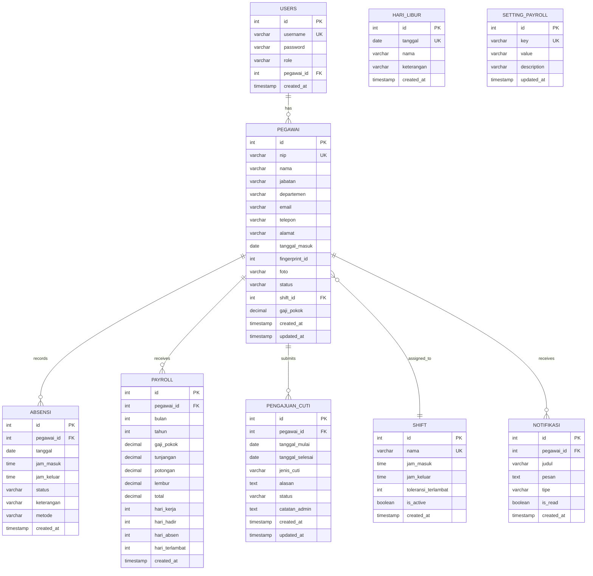

# Entity Relationship Diagram (ERD)

## 1. ERD Diagram



## 2. Deskripsi Tabel

### 2.1 Tabel `users`

Menyimpan data akun pengguna untuk login ke sistem.

| Kolom | Tipe Data | Constraint | Deskripsi |
|-------|-----------|------------|-----------|
| id | SERIAL | PRIMARY KEY | ID unik pengguna |
| username | VARCHAR(50) | UNIQUE, NOT NULL | Username untuk login |
| password | VARCHAR(255) | NOT NULL | Password (hashed) |
| role | VARCHAR(20) | NOT NULL | Role pengguna (admin/user) |
| pegawai_id | INTEGER | FOREIGN KEY | Referensi ke tabel pegawai |
| created_at | TIMESTAMP | DEFAULT NOW() | Waktu pembuatan akun |

### 2.2 Tabel `pegawai`

Menyimpan data master karyawan.

| Kolom | Tipe Data | Constraint | Deskripsi |
|-------|-----------|------------|-----------|
| id | SERIAL | PRIMARY KEY | ID unik pegawai |
| nip | VARCHAR(20) | UNIQUE, NOT NULL | Nomor Induk Pegawai |
| nama | VARCHAR(100) | NOT NULL | Nama lengkap pegawai |
| jabatan | VARCHAR(50) | | Jabatan/posisi |
| departemen | VARCHAR(50) | | Departemen/divisi |
| email | VARCHAR(100) | | Email pegawai |
| telepon | VARCHAR(20) | | Nomor telepon |
| alamat | TEXT | | Alamat lengkap |
| tanggal_masuk | DATE | | Tanggal mulai bekerja |
| fingerprint_id | INTEGER | UNIQUE | ID fingerprint sensor |
| foto | VARCHAR(255) | | Path foto pegawai |
| status | VARCHAR(20) | DEFAULT 'aktif' | Status (aktif/nonaktif) |
| shift_id | INTEGER | FOREIGN KEY | Referensi ke tabel shift |
| gaji_pokok | DECIMAL(15,2) | | Gaji pokok pegawai |
| created_at | TIMESTAMP | DEFAULT NOW() | Waktu pembuatan data |
| updated_at | TIMESTAMP | | Waktu update terakhir |

### 2.3 Tabel `absensi`

Menyimpan rekaman kehadiran harian.

| Kolom | Tipe Data | Constraint | Deskripsi |
|-------|-----------|------------|-----------|
| id | SERIAL | PRIMARY KEY | ID unik absensi |
| pegawai_id | INTEGER | FOREIGN KEY, NOT NULL | Referensi ke pegawai |
| tanggal | DATE | NOT NULL | Tanggal absensi |
| jam_masuk | TIME | | Waktu masuk |
| jam_keluar | TIME | | Waktu keluar |
| status | VARCHAR(20) | | Status (hadir/terlambat/izin/sakit/alpha) |
| keterangan | TEXT | | Keterangan tambahan |
| metode | VARCHAR(20) | | Metode absen (fingerprint/manual) |
| created_at | TIMESTAMP | DEFAULT NOW() | Waktu pencatatan |

### 2.4 Tabel `payroll`

Menyimpan data penggajian bulanan.

| Kolom | Tipe Data | Constraint | Deskripsi |
|-------|-----------|------------|-----------|
| id | SERIAL | PRIMARY KEY | ID unik payroll |
| pegawai_id | INTEGER | FOREIGN KEY, NOT NULL | Referensi ke pegawai |
| bulan | INTEGER | NOT NULL | Bulan (1-12) |
| tahun | INTEGER | NOT NULL | Tahun |
| gaji_pokok | DECIMAL(15,2) | | Gaji pokok |
| tunjangan | DECIMAL(15,2) | DEFAULT 0 | Total tunjangan |
| potongan | DECIMAL(15,2) | DEFAULT 0 | Total potongan |
| lembur | DECIMAL(15,2) | DEFAULT 0 | Upah lembur |
| total | DECIMAL(15,2) | | Total gaji bersih |
| hari_kerja | INTEGER | | Jumlah hari kerja |
| hari_hadir | INTEGER | | Jumlah hari hadir |
| hari_absen | INTEGER | | Jumlah hari absen |
| hari_terlambat | INTEGER | | Jumlah hari terlambat |
| created_at | TIMESTAMP | DEFAULT NOW() | Waktu generate payroll |

### 2.5 Tabel `pengajuan_cuti`

Menyimpan pengajuan cuti karyawan.

| Kolom | Tipe Data | Constraint | Deskripsi |
|-------|-----------|------------|-----------|
| id | SERIAL | PRIMARY KEY | ID unik pengajuan |
| pegawai_id | INTEGER | FOREIGN KEY, NOT NULL | Referensi ke pegawai |
| tanggal_mulai | DATE | NOT NULL | Tanggal mulai cuti |
| tanggal_selesai | DATE | NOT NULL | Tanggal selesai cuti |
| jenis_cuti | VARCHAR(50) | NOT NULL | Jenis cuti (tahunan/sakit/melahirkan/dll) |
| alasan | TEXT | | Alasan pengajuan cuti |
| status | VARCHAR(20) | DEFAULT 'pending' | Status (pending/approved/rejected) |
| catatan_admin | TEXT | | Catatan dari admin |
| created_at | TIMESTAMP | DEFAULT NOW() | Waktu pengajuan |
| updated_at | TIMESTAMP | | Waktu update status |

### 2.6 Tabel `shift`

Menyimpan konfigurasi shift kerja.

| Kolom | Tipe Data | Constraint | Deskripsi |
|-------|-----------|------------|-----------|
| id | SERIAL | PRIMARY KEY | ID unik shift |
| nama | VARCHAR(50) | UNIQUE, NOT NULL | Nama shift |
| jam_masuk | TIME | NOT NULL | Jam masuk standar |
| jam_keluar | TIME | NOT NULL | Jam keluar standar |
| toleransi_terlambat | INTEGER | DEFAULT 15 | Toleransi terlambat (menit) |
| is_active | BOOLEAN | DEFAULT TRUE | Status aktif shift |
| created_at | TIMESTAMP | DEFAULT NOW() | Waktu pembuatan |

### 2.7 Tabel `hari_libur`

Menyimpan daftar hari libur.

| Kolom | Tipe Data | Constraint | Deskripsi |
|-------|-----------|------------|-----------|
| id | SERIAL | PRIMARY KEY | ID unik |
| tanggal | DATE | UNIQUE, NOT NULL | Tanggal libur |
| nama | VARCHAR(100) | NOT NULL | Nama hari libur |
| keterangan | TEXT | | Keterangan tambahan |
| created_at | TIMESTAMP | DEFAULT NOW() | Waktu pembuatan |

### 2.8 Tabel `notifikasi`

Menyimpan notifikasi untuk pengguna.

| Kolom | Tipe Data | Constraint | Deskripsi |
|-------|-----------|------------|-----------|
| id | SERIAL | PRIMARY KEY | ID unik notifikasi |
| pegawai_id | INTEGER | FOREIGN KEY | Referensi ke pegawai (NULL = all) |
| judul | VARCHAR(100) | NOT NULL | Judul notifikasi |
| pesan | TEXT | NOT NULL | Isi pesan |
| tipe | VARCHAR(20) | | Tipe (info/warning/success/error) |
| is_read | BOOLEAN | DEFAULT FALSE | Status sudah dibaca |
| created_at | TIMESTAMP | DEFAULT NOW() | Waktu pembuatan |

### 2.9 Tabel `setting_payroll`

Menyimpan konfigurasi penggajian.

| Kolom | Tipe Data | Constraint | Deskripsi |
|-------|-----------|------------|-----------|
| id | SERIAL | PRIMARY KEY | ID unik setting |
| key | VARCHAR(50) | UNIQUE, NOT NULL | Nama setting |
| value | VARCHAR(255) | | Nilai setting |
| description | TEXT | | Deskripsi setting |
| updated_at | TIMESTAMP | DEFAULT NOW() | Waktu update |

---

## 3. Relasi Antar Tabel

```
┌─────────────────────────────────────────────────────────────────┐
│                        RELASI DATABASE                           │
├─────────────────────────────────────────────────────────────────┤
│                                                                  │
│  USERS ──────────────────────────── PEGAWAI                     │
│    │            1:1                    │                        │
│    │                                   │                        │
│    └─ users.pegawai_id = pegawai.id    │                        │
│                                        │                        │
│                          ┌─────────────┼─────────────┐          │
│                          │             │             │          │
│                          ▼             ▼             ▼          │
│                       ABSENSI      PAYROLL    PENGAJUAN_CUTI    │
│                        (1:N)        (1:N)         (1:N)         │
│                                                                  │
│  PEGAWAI ────────────── SHIFT                                   │
│              N:1                                                │
│              pegawai.shift_id = shift.id                        │
│                                                                  │
│  PEGAWAI ────────────── NOTIFIKASI                              │
│              1:N                                                │
│              notifikasi.pegawai_id = pegawai.id                 │
│                                                                  │
└─────────────────────────────────────────────────────────────────┘
```

### Kardinalitas:

| Relasi | Kardinalitas | Deskripsi |
|--------|--------------|-----------|
| USERS - PEGAWAI | 1:1 | Satu user memiliki satu pegawai |
| PEGAWAI - ABSENSI | 1:N | Satu pegawai memiliki banyak record absensi |
| PEGAWAI - PAYROLL | 1:N | Satu pegawai memiliki banyak record payroll |
| PEGAWAI - PENGAJUAN_CUTI | 1:N | Satu pegawai bisa mengajukan banyak cuti |
| PEGAWAI - SHIFT | N:1 | Banyak pegawai bisa memiliki satu shift yang sama |
| PEGAWAI - NOTIFIKASI | 1:N | Satu pegawai menerima banyak notifikasi |

---

## 4. SQL Schema

```sql
-- Tabel Shift (harus dibuat lebih dulu karena direferensi oleh pegawai)
CREATE TABLE shift (
    id SERIAL PRIMARY KEY,
    nama VARCHAR(50) UNIQUE NOT NULL,
    jam_masuk TIME NOT NULL,
    jam_keluar TIME NOT NULL,
    toleransi_terlambat INTEGER DEFAULT 15,
    is_active BOOLEAN DEFAULT TRUE,
    created_at TIMESTAMP DEFAULT CURRENT_TIMESTAMP
);

-- Tabel Pegawai
CREATE TABLE pegawai (
    id SERIAL PRIMARY KEY,
    nip VARCHAR(20) UNIQUE NOT NULL,
    nama VARCHAR(100) NOT NULL,
    jabatan VARCHAR(50),
    departemen VARCHAR(50),
    email VARCHAR(100),
    telepon VARCHAR(20),
    alamat TEXT,
    tanggal_masuk DATE,
    fingerprint_id INTEGER UNIQUE,
    foto VARCHAR(255),
    status VARCHAR(20) DEFAULT 'aktif',
    shift_id INTEGER REFERENCES shift(id),
    gaji_pokok DECIMAL(15,2),
    created_at TIMESTAMP DEFAULT CURRENT_TIMESTAMP,
    updated_at TIMESTAMP
);

-- Tabel Users
CREATE TABLE users (
    id SERIAL PRIMARY KEY,
    username VARCHAR(50) UNIQUE NOT NULL,
    password VARCHAR(255) NOT NULL,
    role VARCHAR(20) NOT NULL,
    pegawai_id INTEGER REFERENCES pegawai(id),
    created_at TIMESTAMP DEFAULT CURRENT_TIMESTAMP
);

-- Tabel Absensi
CREATE TABLE absensi (
    id SERIAL PRIMARY KEY,
    pegawai_id INTEGER NOT NULL REFERENCES pegawai(id),
    tanggal DATE NOT NULL,
    jam_masuk TIME,
    jam_keluar TIME,
    status VARCHAR(20),
    keterangan TEXT,
    metode VARCHAR(20),
    created_at TIMESTAMP DEFAULT CURRENT_TIMESTAMP
);

-- Tabel Payroll
CREATE TABLE payroll (
    id SERIAL PRIMARY KEY,
    pegawai_id INTEGER NOT NULL REFERENCES pegawai(id),
    bulan INTEGER NOT NULL,
    tahun INTEGER NOT NULL,
    gaji_pokok DECIMAL(15,2),
    tunjangan DECIMAL(15,2) DEFAULT 0,
    potongan DECIMAL(15,2) DEFAULT 0,
    lembur DECIMAL(15,2) DEFAULT 0,
    total DECIMAL(15,2),
    hari_kerja INTEGER,
    hari_hadir INTEGER,
    hari_absen INTEGER,
    hari_terlambat INTEGER,
    created_at TIMESTAMP DEFAULT CURRENT_TIMESTAMP
);

-- Tabel Pengajuan Cuti
CREATE TABLE pengajuan_cuti (
    id SERIAL PRIMARY KEY,
    pegawai_id INTEGER NOT NULL REFERENCES pegawai(id),
    tanggal_mulai DATE NOT NULL,
    tanggal_selesai DATE NOT NULL,
    jenis_cuti VARCHAR(50) NOT NULL,
    alasan TEXT,
    status VARCHAR(20) DEFAULT 'pending',
    catatan_admin TEXT,
    created_at TIMESTAMP DEFAULT CURRENT_TIMESTAMP,
    updated_at TIMESTAMP
);

-- Tabel Hari Libur
CREATE TABLE hari_libur (
    id SERIAL PRIMARY KEY,
    tanggal DATE UNIQUE NOT NULL,
    nama VARCHAR(100) NOT NULL,
    keterangan TEXT,
    created_at TIMESTAMP DEFAULT CURRENT_TIMESTAMP
);

-- Tabel Notifikasi
CREATE TABLE notifikasi (
    id SERIAL PRIMARY KEY,
    pegawai_id INTEGER REFERENCES pegawai(id),
    judul VARCHAR(100) NOT NULL,
    pesan TEXT NOT NULL,
    tipe VARCHAR(20),
    is_read BOOLEAN DEFAULT FALSE,
    created_at TIMESTAMP DEFAULT CURRENT_TIMESTAMP
);

-- Tabel Setting Payroll
CREATE TABLE setting_payroll (
    id SERIAL PRIMARY KEY,
    key VARCHAR(50) UNIQUE NOT NULL,
    value VARCHAR(255),
    description TEXT,
    updated_at TIMESTAMP DEFAULT CURRENT_TIMESTAMP
);

-- Indexes
CREATE INDEX idx_absensi_pegawai ON absensi(pegawai_id);
CREATE INDEX idx_absensi_tanggal ON absensi(tanggal);
CREATE INDEX idx_payroll_pegawai ON payroll(pegawai_id);
CREATE INDEX idx_payroll_periode ON payroll(bulan, tahun);
CREATE INDEX idx_cuti_pegawai ON pengajuan_cuti(pegawai_id);
CREATE INDEX idx_notifikasi_pegawai ON notifikasi(pegawai_id);
```
