# Flowcharts

## 1. Flowchart Login

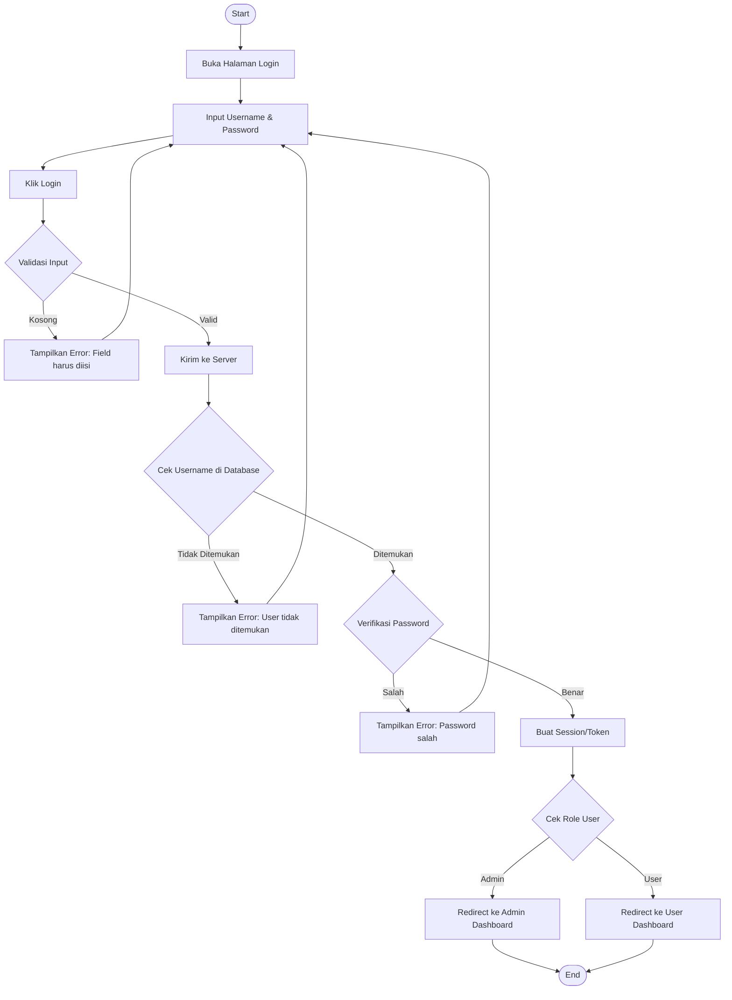

## 2. Flowchart Absensi Fingerprint

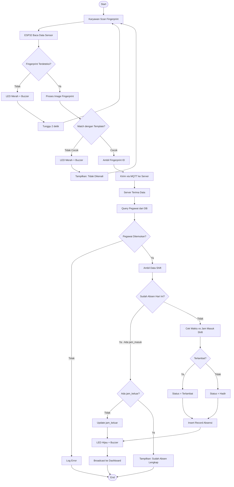

## 3. Flowchart Pengajuan Cuti

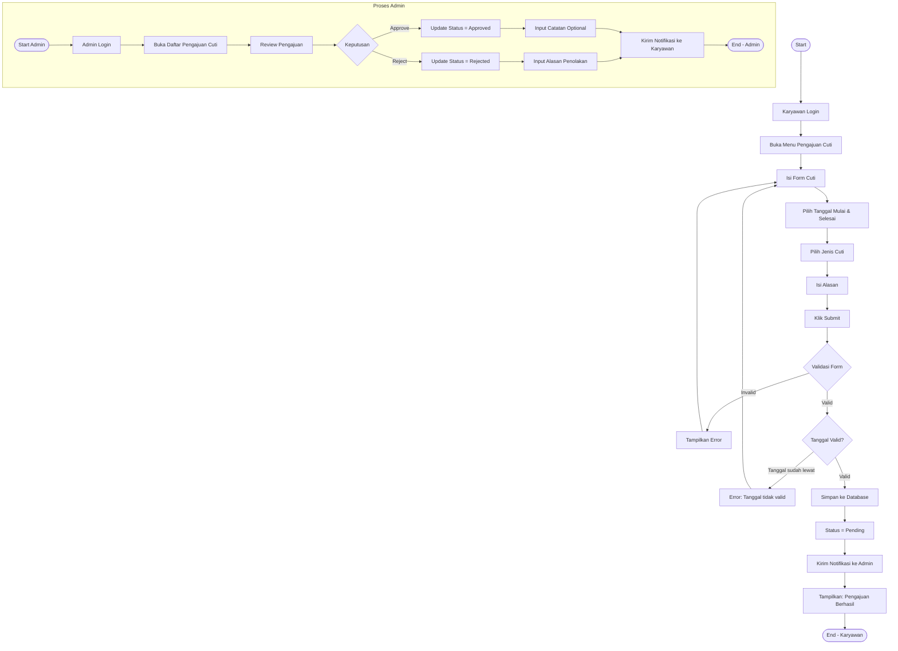

## 4. Flowchart Generate Payroll

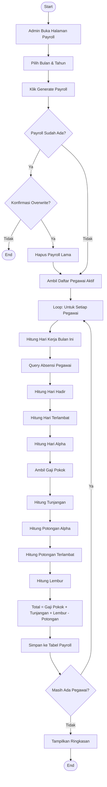

## 5. Flowchart Enrollment Fingerprint

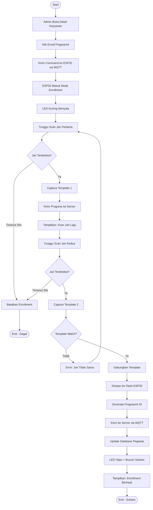

## 6. Flowchart Backup Data

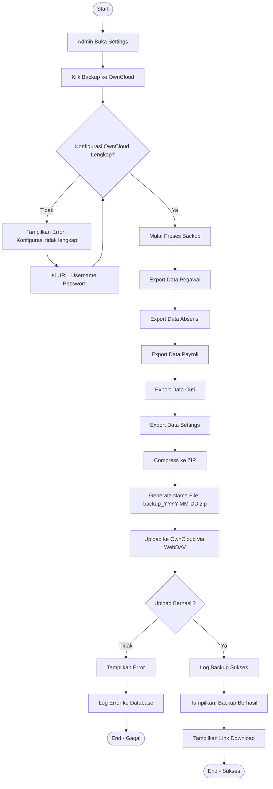

## 7. Flowchart Laporan Absensi

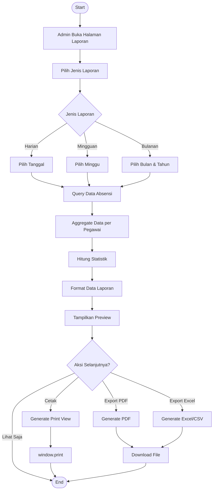

## 8. Flowchart Manajemen Shift

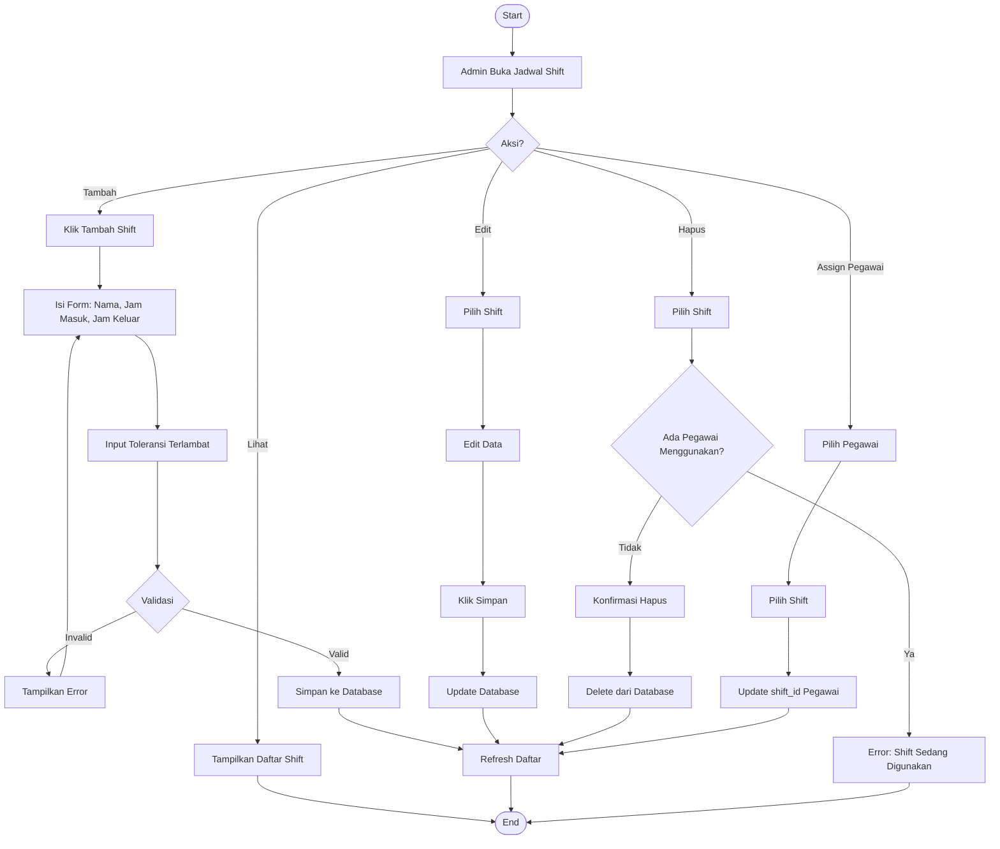

## 9. Flowchart Hari Libur

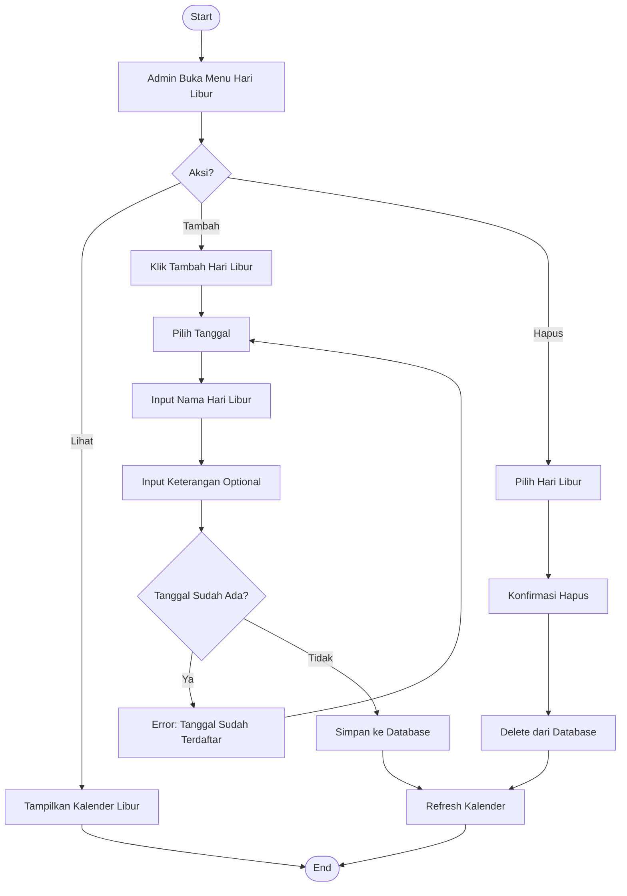

## 10. Flowchart User Dashboard

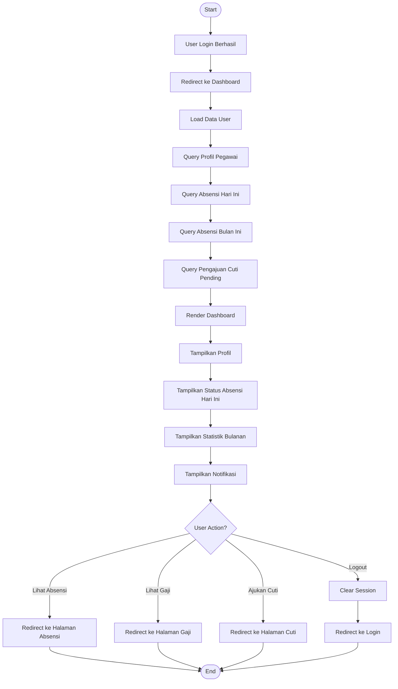

## 11. Flowchart System Startup

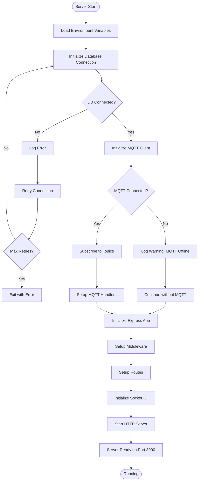

## 12. Flowchart Real-time Updates

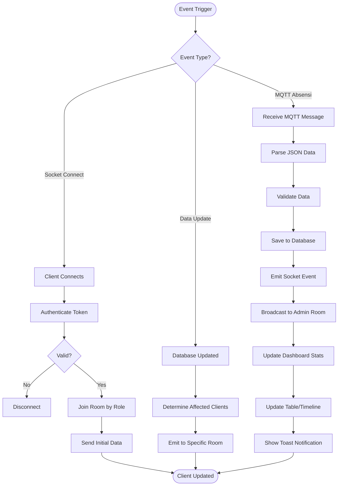
