# HIPO (Hierarchy plus Input-Process-Output)

## 1. Diagram Hierarki Sistem

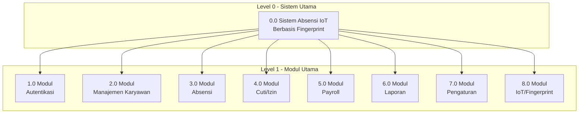

---

## 2. Diagram Hierarki Detail

### 2.1 Modul Autentikasi (1.0)

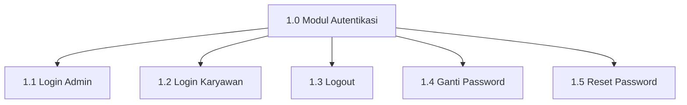

### 2.2 Modul Manajemen Karyawan (2.0)

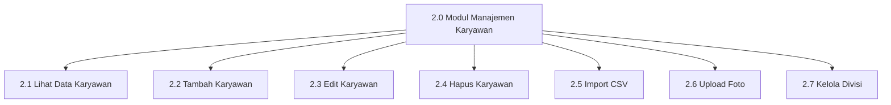

### 2.3 Modul Absensi (3.0)

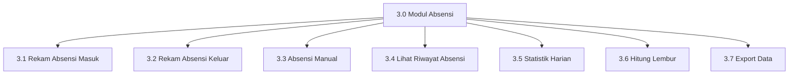

### 2.4 Modul Cuti/Izin (4.0)

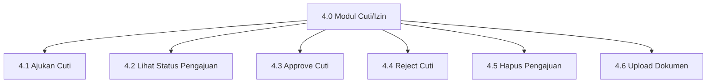

### 2.5 Modul Payroll (5.0)

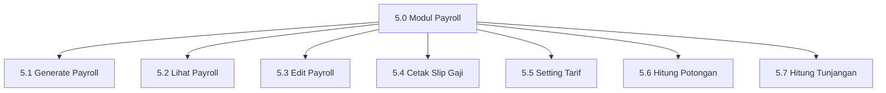

### 2.6 Modul Laporan (6.0)

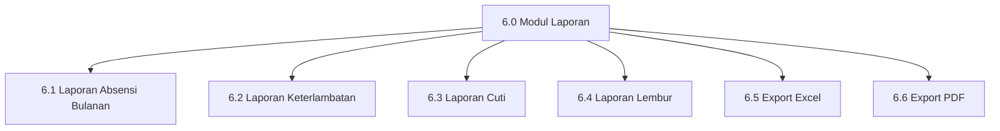

### 2.7 Modul Pengaturan (7.0)

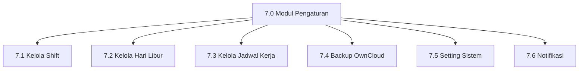

### 2.8 Modul IoT/Fingerprint (8.0)

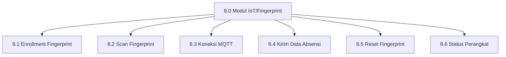

---

## 3. Tabel IPO (Input-Process-Output)

### 3.1 Modul Autentikasi (1.0)

| No | Fungsi | Input | Process | Output |
|----|--------|-------|---------|--------|
| 1.1 | Login Admin | Username, Password | Validasi kredensial di tabel `users` | Session admin, redirect dashboard |
| 1.2 | Login Karyawan | NIP, Password | Validasi kredensial di tabel `pegawai` | Session user, data pegawai |
| 1.3 | Logout | Session ID | Hapus session dari storage | Redirect ke halaman login |
| 1.4 | Ganti Password | Password lama, Password baru | Validasi password lama, update password | Status berhasil/gagal |
| 1.5 | Reset Password | ID Pegawai | Generate password default (NIP) | Password ter-reset |

### 3.2 Modul Manajemen Karyawan (2.0)

| No | Fungsi | Input | Process | Output |
|----|--------|-------|---------|--------|
| 2.1 | Lihat Data Karyawan | - | Query SELECT dari tabel `pegawai` | List data karyawan |
| 2.2 | Tambah Karyawan | NIP, Nama, Posisi, Email, dll | INSERT ke tabel `pegawai` | Data karyawan baru |
| 2.3 | Edit Karyawan | ID, Data update | UPDATE tabel `pegawai` | Data karyawan terupdate |
| 2.4 | Hapus Karyawan | ID Pegawai | DELETE dari tabel `pegawai` | Status penghapusan |
| 2.5 | Import CSV | File CSV | Parse CSV, batch INSERT | Jumlah data terimport |
| 2.6 | Upload Foto | ID Pegawai, File foto | Simpan file, update path di DB | URL foto tersimpan |
| 2.7 | Kelola Divisi | Nama divisi | CRUD tabel `divisi` | Data divisi |

### 3.3 Modul Absensi (3.0)

| No | Fungsi | Input | Process | Output |
|----|--------|-------|---------|--------|
| 3.1 | Rekam Absensi Masuk | Fingerprint ID, Timestamp | Cari pegawai, cek status, INSERT absensi | Data absensi masuk |
| 3.2 | Rekam Absensi Keluar | Fingerprint ID, Timestamp | Update waktu_keluar, hitung durasi | Data absensi keluar, durasi kerja |
| 3.3 | Absensi Manual | ID Pegawai, Waktu, Keterangan | INSERT/UPDATE tabel `absensi` | Data absensi manual |
| 3.4 | Lihat Riwayat Absensi | Filter (tanggal, pegawai) | Query JOIN pegawai & absensi | List riwayat absensi |
| 3.5 | Statistik Harian | Tanggal | COUNT & GROUP BY keterangan | Jumlah hadir, terlambat, izin |
| 3.6 | Hitung Lembur | ID Absensi, Waktu keluar | Bandingkan dengan jam shift | Durasi lembur (menit) |
| 3.7 | Export Data | Filter, Format | Query data, generate file | File Excel/CSV |

### 3.4 Modul Cuti/Izin (4.0)

| No | Fungsi | Input | Process | Output |
|----|--------|-------|---------|--------|
| 4.1 | Ajukan Cuti | ID Pegawai, Jenis, Tanggal, Alasan | INSERT ke `pengajuan_cuti` | Data pengajuan, notifikasi admin |
| 4.2 | Lihat Status Pengajuan | ID Pegawai | Query pengajuan by pegawai | List pengajuan & status |
| 4.3 | Approve Cuti | ID Pengajuan, Komentar | UPDATE status = 'Disetujui' | Status terupdate, notifikasi user |
| 4.4 | Reject Cuti | ID Pengajuan, Komentar | UPDATE status = 'Ditolak' | Status terupdate, notifikasi user |
| 4.5 | Hapus Pengajuan | ID Pengajuan | DELETE dari `pengajuan_cuti` | Status penghapusan |
| 4.6 | Upload Dokumen | ID Pengajuan, File | Simpan file, update path | URL dokumen |

### 3.5 Modul Payroll (5.0)

| No | Fungsi | Input | Process | Output |
|----|--------|-------|---------|--------|
| 5.1 | Generate Payroll | Bulan, Tahun | Hitung kehadiran, lembur, potongan | Data payroll per pegawai |
| 5.2 | Lihat Payroll | Filter (bulan, tahun, pegawai) | Query tabel `payroll` | List data payroll |
| 5.3 | Edit Payroll | ID Payroll, Data update | UPDATE tabel `payroll` | Payroll terupdate |
| 5.4 | Cetak Slip Gaji | ID Payroll | Generate PDF slip gaji | File PDF slip gaji |
| 5.5 | Setting Tarif | Nama setting, Nilai | UPDATE `setting_payroll` | Tarif terupdate |
| 5.6 | Hitung Potongan | Total terlambat, Absen | Kalkulasi berdasarkan tarif | Nominal potongan |
| 5.7 | Hitung Tunjangan | ID Pegawai | Ambil tunjangan dari setting | Nominal tunjangan |

### 3.6 Modul Laporan (6.0)

| No | Fungsi | Input | Process | Output |
|----|--------|-------|---------|--------|
| 6.1 | Laporan Absensi Bulanan | Bulan, Tahun | Query & agregasi data absensi | Rekap absensi bulanan |
| 6.2 | Laporan Keterlambatan | Bulan, Tahun | Filter keterangan = 'Terlambat' | List keterlambatan |
| 6.3 | Laporan Cuti | Bulan, Tahun | Query `pengajuan_cuti` | Rekap pengajuan cuti |
| 6.4 | Laporan Lembur | Bulan, Tahun | Filter status_lembur = 'Ya' | Rekap jam lembur |
| 6.5 | Export Excel | Data laporan | Generate file XLSX | File Excel |
| 6.6 | Export PDF | Data laporan | Generate file PDF | File PDF |

### 3.7 Modul Pengaturan (7.0)

| No | Fungsi | Input | Process | Output |
|----|--------|-------|---------|--------|
| 7.1 | Kelola Shift | Data shift (nama, jam) | CRUD tabel `shift` | Data shift |
| 7.2 | Kelola Hari Libur | Tanggal, Nama libur | CRUD tabel `hari_libur` | Data hari libur |
| 7.3 | Kelola Jadwal Kerja | Template jadwal mingguan | CRUD tabel `jadwal_kerja` | Data jadwal |
| 7.4 | Backup OwnCloud | Konfigurasi WebDAV | Upload database ke cloud | Status backup |
| 7.5 | Setting Sistem | Key-value setting | UPDATE `settings` | Konfigurasi tersimpan |
| 7.6 | Notifikasi | Event trigger | INSERT `notifikasi`, emit Socket.IO | Notifikasi real-time |

### 3.8 Modul IoT/Fingerprint (8.0)

| No | Fungsi | Input | Process | Output |
|----|--------|-------|---------|--------|
| 8.1 | Enrollment Fingerprint | ID Pegawai | Kirim MQTT command, simpan template | Fingerprint ID tersimpan |
| 8.2 | Scan Fingerprint | Data sidik jari | Verifikasi 1:N di sensor | Fingerprint ID match |
| 8.3 | Koneksi MQTT | Config broker | Connect ke Aedes broker | Status koneksi |
| 8.4 | Kirim Data Absensi | Fingerprint ID, Timestamp | Publish ke topic MQTT | Data absensi terkirim |
| 8.5 | Reset Fingerprint | ID Pegawai | Hapus template di sensor & DB | Fingerprint ter-reset |
| 8.6 | Status Perangkat | - | Query connected clients | List ESP32 terhubung |

---

## 4. Diagram IPO Visual

### 4.1 IPO Login Karyawan (1.2)

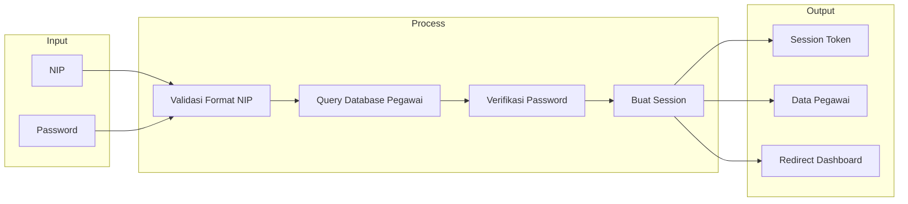

### 4.2 IPO Rekam Absensi Masuk (3.1)

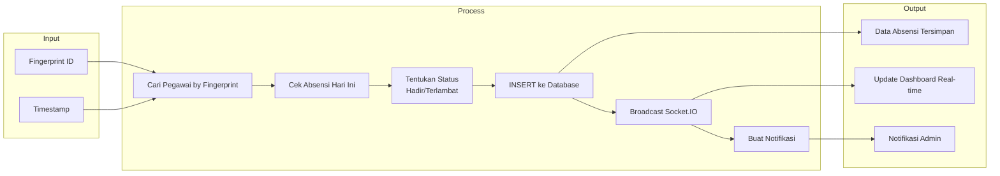

### 4.3 IPO Generate Payroll (5.1)

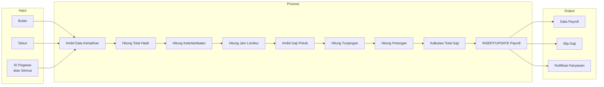

### 4.4 IPO Enrollment Fingerprint (8.1)

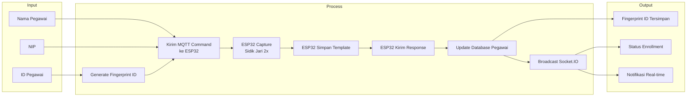

### 4.5 IPO Ajukan Cuti (4.1)

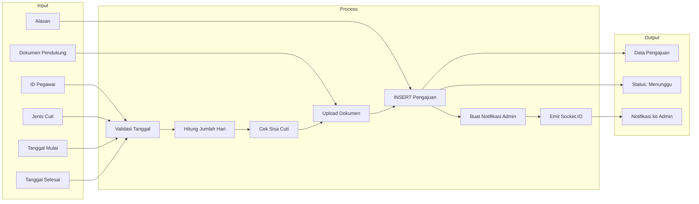

---

## 5. Ringkasan Hierarki Sistem

```
0.0 Sistem Absensi IoT Berbasis Fingerprint
│
├── 1.0 Modul Autentikasi
│   ├── 1.1 Login Admin
│   ├── 1.2 Login Karyawan
│   ├── 1.3 Logout
│   ├── 1.4 Ganti Password
│   └── 1.5 Reset Password
│
├── 2.0 Modul Manajemen Karyawan
│   ├── 2.1 Lihat Data Karyawan
│   ├── 2.2 Tambah Karyawan
│   ├── 2.3 Edit Karyawan
│   ├── 2.4 Hapus Karyawan
│   ├── 2.5 Import CSV
│   ├── 2.6 Upload Foto
│   └── 2.7 Kelola Divisi
│
├── 3.0 Modul Absensi
│   ├── 3.1 Rekam Absensi Masuk
│   ├── 3.2 Rekam Absensi Keluar
│   ├── 3.3 Absensi Manual
│   ├── 3.4 Lihat Riwayat Absensi
│   ├── 3.5 Statistik Harian
│   ├── 3.6 Hitung Lembur
│   └── 3.7 Export Data
│
├── 4.0 Modul Cuti/Izin
│   ├── 4.1 Ajukan Cuti
│   ├── 4.2 Lihat Status Pengajuan
│   ├── 4.3 Approve Cuti
│   ├── 4.4 Reject Cuti
│   ├── 4.5 Hapus Pengajuan
│   └── 4.6 Upload Dokumen
│
├── 5.0 Modul Payroll
│   ├── 5.1 Generate Payroll
│   ├── 5.2 Lihat Payroll
│   ├── 5.3 Edit Payroll
│   ├── 5.4 Cetak Slip Gaji
│   ├── 5.5 Setting Tarif
│   ├── 5.6 Hitung Potongan
│   └── 5.7 Hitung Tunjangan
│
├── 6.0 Modul Laporan
│   ├── 6.1 Laporan Absensi Bulanan
│   ├── 6.2 Laporan Keterlambatan
│   ├── 6.3 Laporan Cuti
│   ├── 6.4 Laporan Lembur
│   ├── 6.5 Export Excel
│   └── 6.6 Export PDF
│
├── 7.0 Modul Pengaturan
│   ├── 7.1 Kelola Shift
│   ├── 7.2 Kelola Hari Libur
│   ├── 7.3 Kelola Jadwal Kerja
│   ├── 7.4 Backup OwnCloud
│   ├── 7.5 Setting Sistem
│   └── 7.6 Notifikasi
│
└── 8.0 Modul IoT/Fingerprint
    ├── 8.1 Enrollment Fingerprint
    ├── 8.2 Scan Fingerprint
    ├── 8.3 Koneksi MQTT
    ├── 8.4 Kirim Data Absensi
    ├── 8.5 Reset Fingerprint
    └── 8.6 Status Perangkat
```

---

## 6. Keterangan

### Penjelasan HIPO
**HIPO (Hierarchy plus Input-Process-Output)** adalah teknik dokumentasi yang menggambarkan:
1. **Hierarki** - Struktur modul sistem dari level tertinggi ke terendah
2. **IPO** - Alur data dari Input, melalui Process, menghasilkan Output

### Kegunaan HIPO
- Memudahkan pemahaman struktur sistem
- Dokumentasi untuk maintenance dan pengembangan
- Acuan untuk testing dan debugging
- Komunikasi dengan stakeholder

### Teknologi Terkait
| Komponen | Teknologi |
|----------|-----------|
| Backend | Node.js + Express 5.1 |
| Database | PostgreSQL |
| Real-time | Socket.IO |
| IoT Communication | MQTT (Aedes Broker) |
| Frontend | HTML/CSS/JS (Glassmorphism) |
| Hardware | ESP32 + Fingerprint Sensor |

---

*Dokumentasi HIPO - Sistem Absensi IoT Berbasis Fingerprint*
*Dibuat: Januari 2026*
