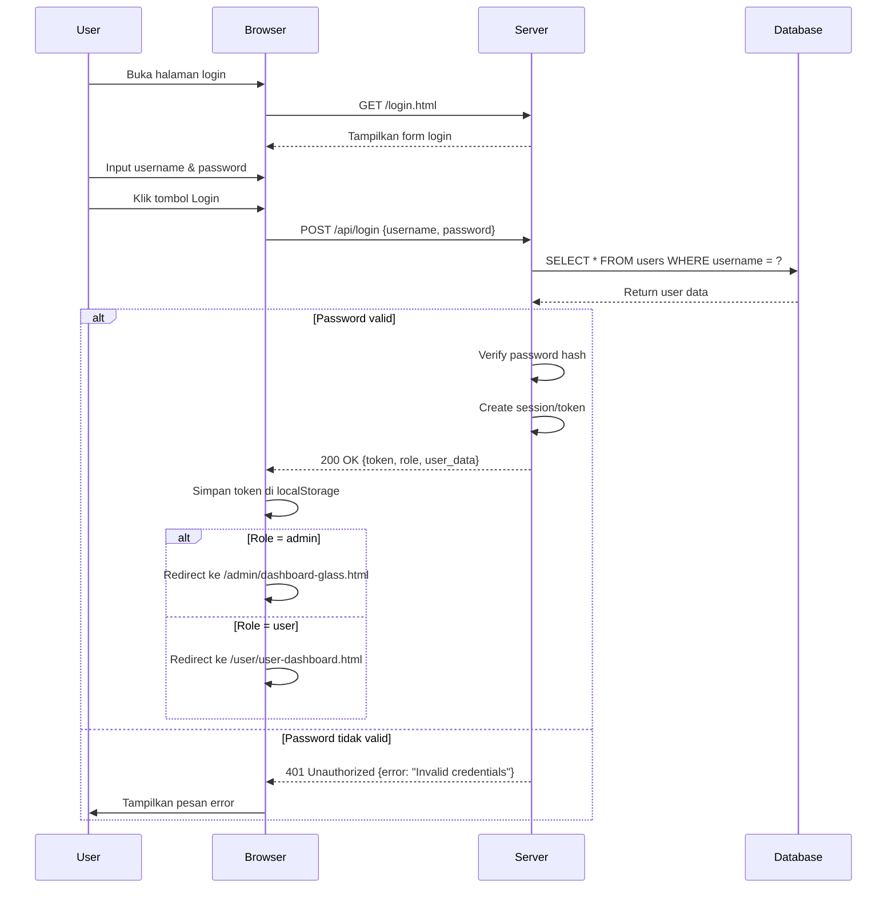
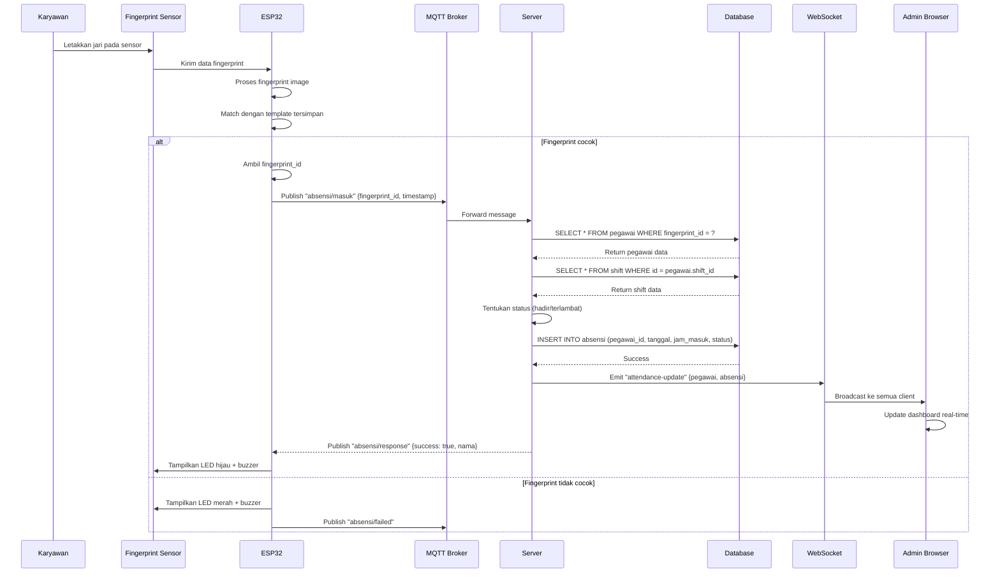
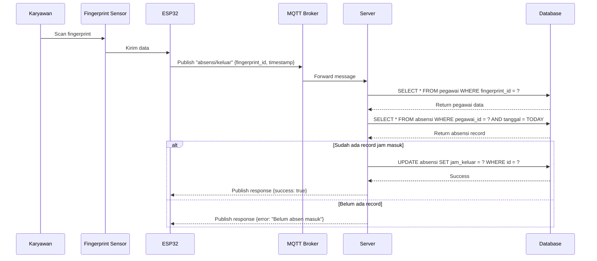
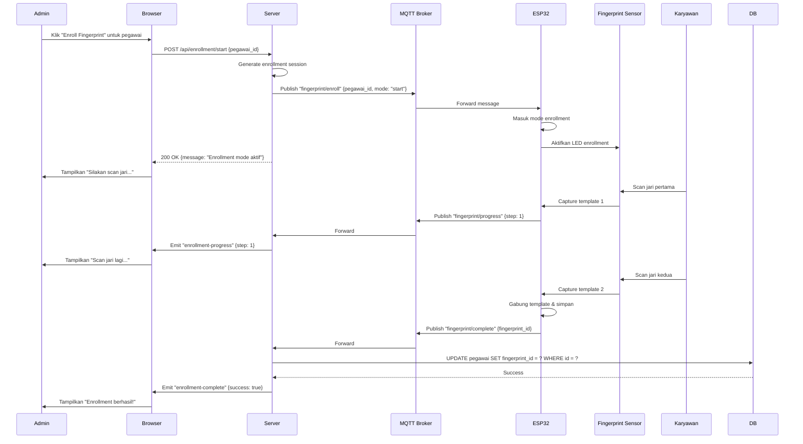
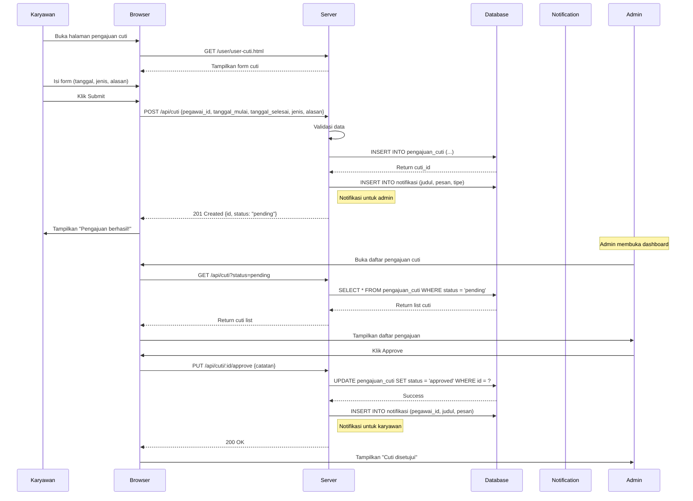
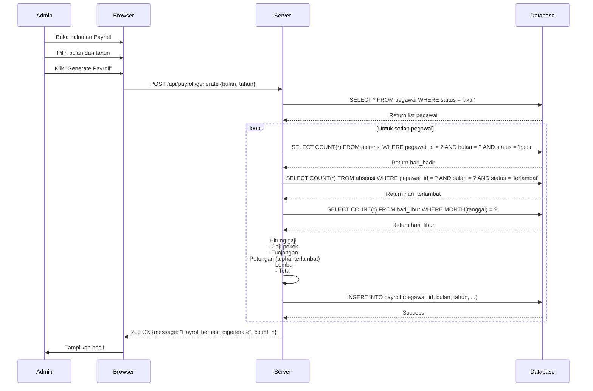
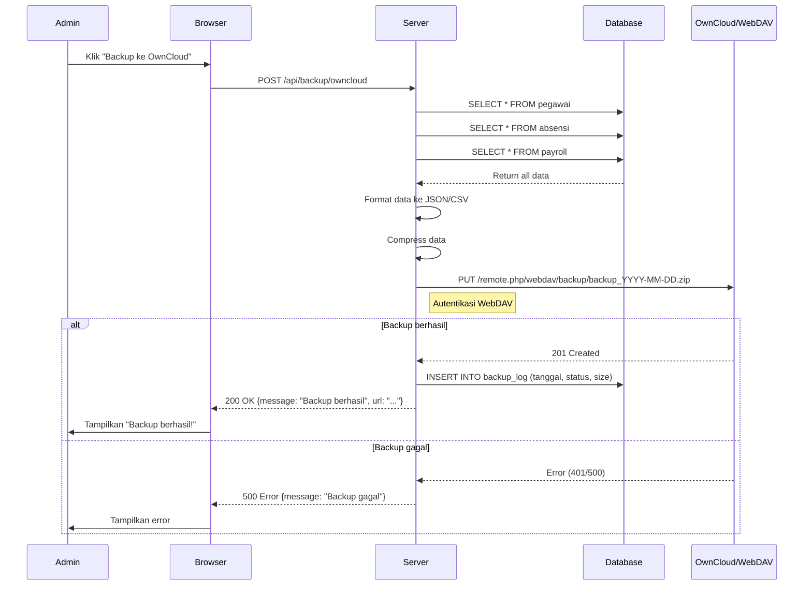
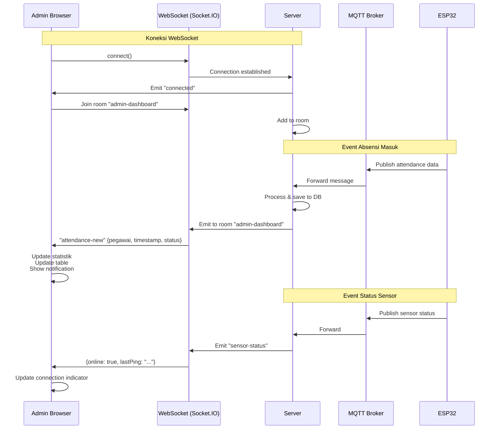
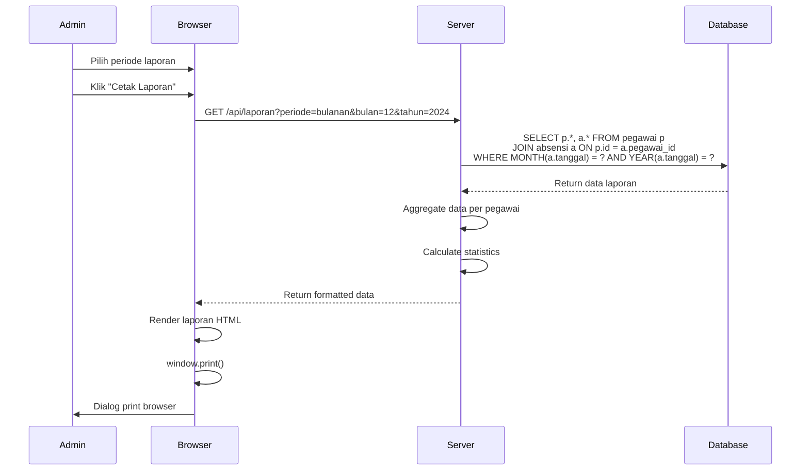
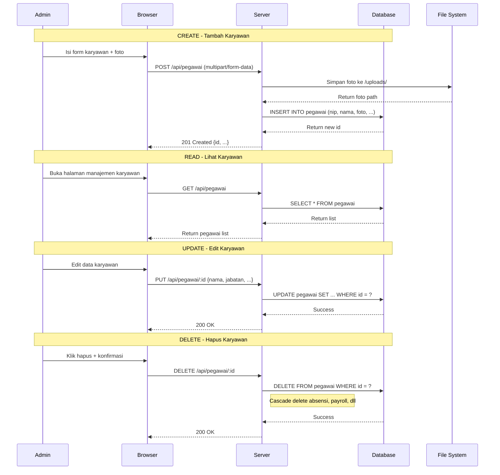

# Sequence Diagrams

## 1. Proses Login

## 2. Proses Absensi via Fingerprint

## 3. Proses Absensi Pulang

## 4. Proses Enrollment Fingerprint

## 5. Proses Pengajuan Cuti

## 6. Proses Generate Payroll

## 7. Proses Backup ke OwnCloud

## 8. Proses Real-time Dashboard Update

## 9. Proses Cetak Laporan

## 10. Proses CRUD Karyawan

