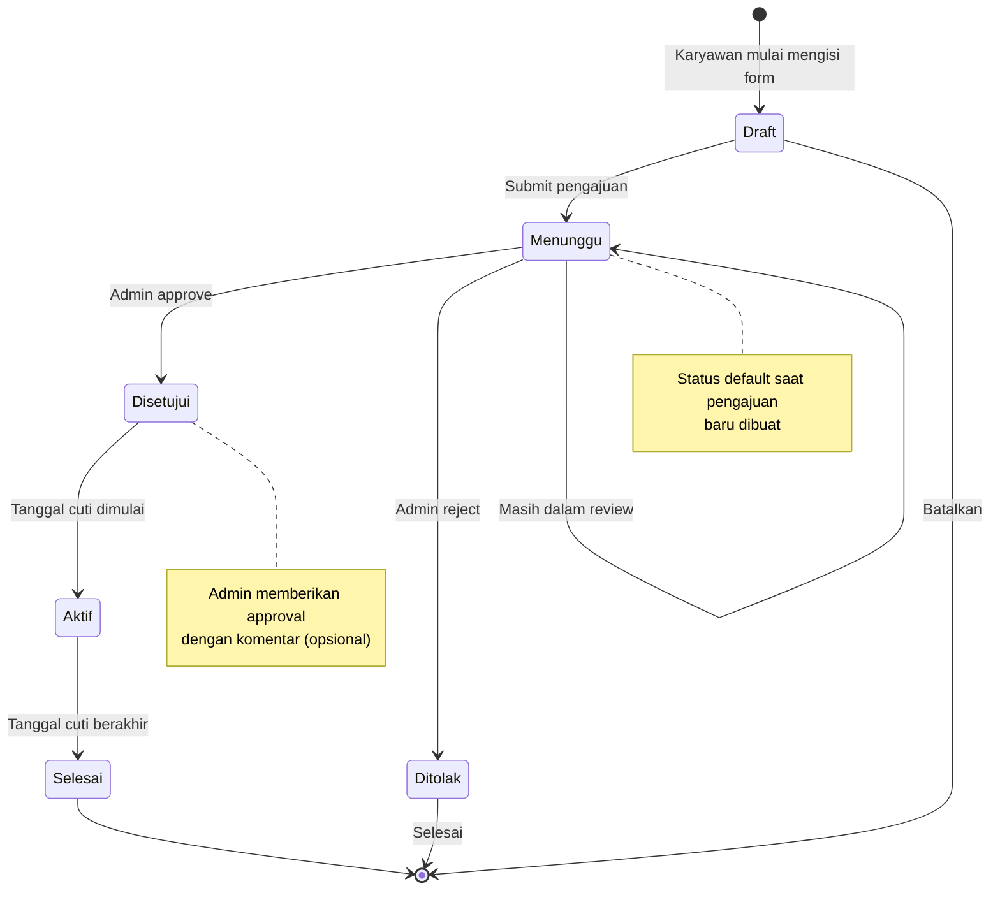
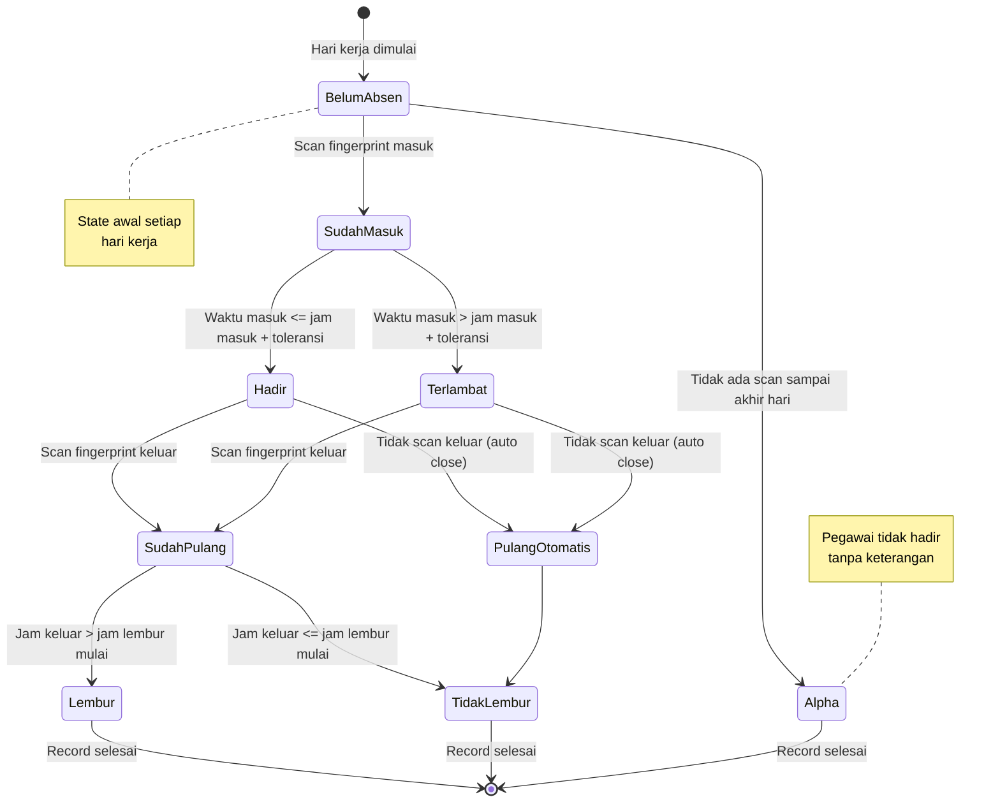
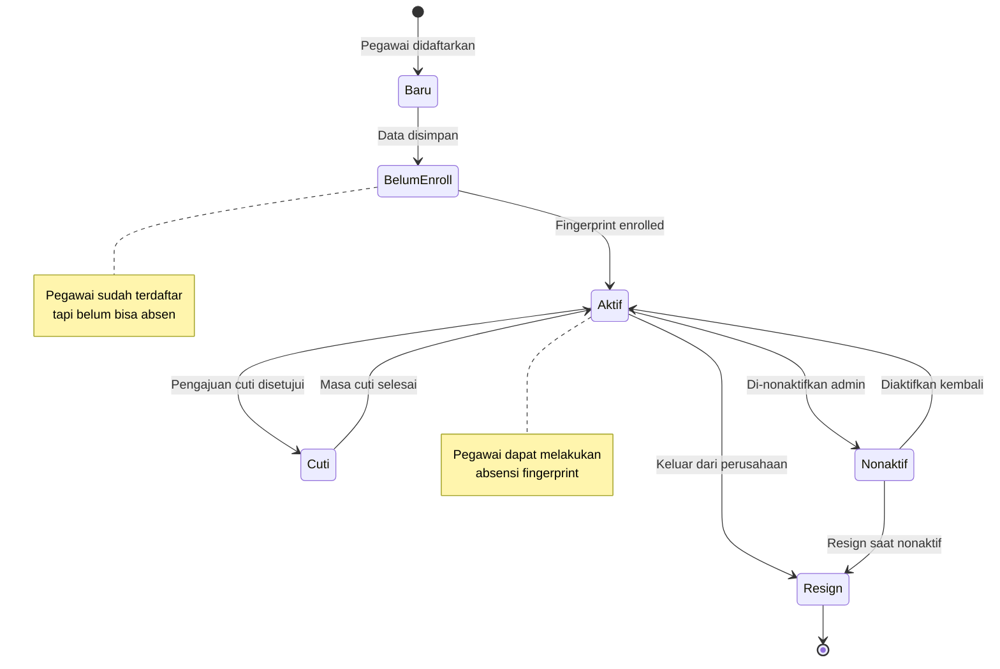
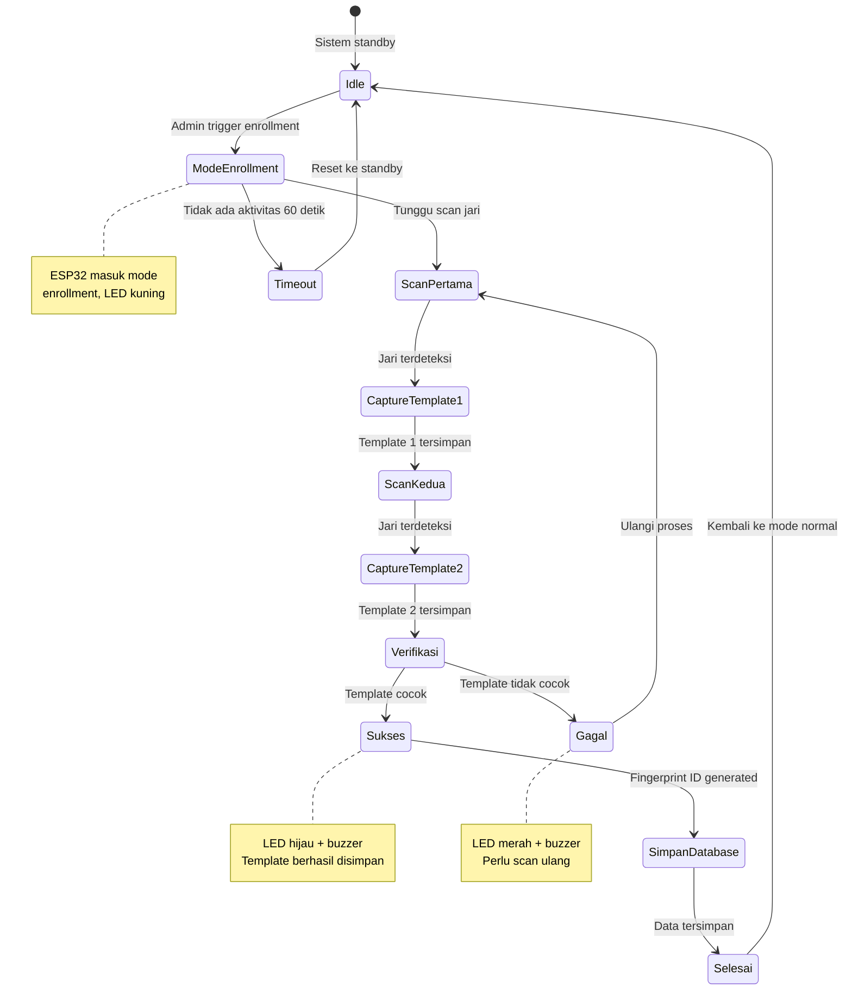
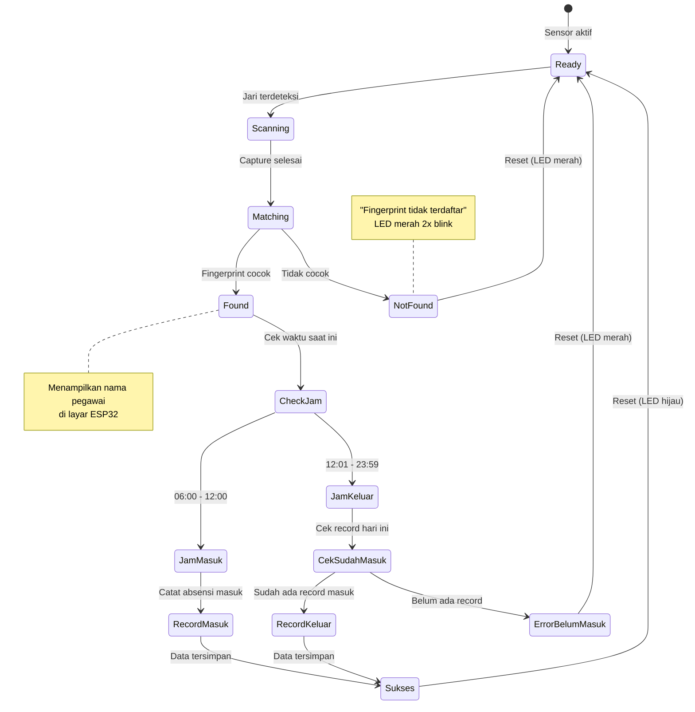
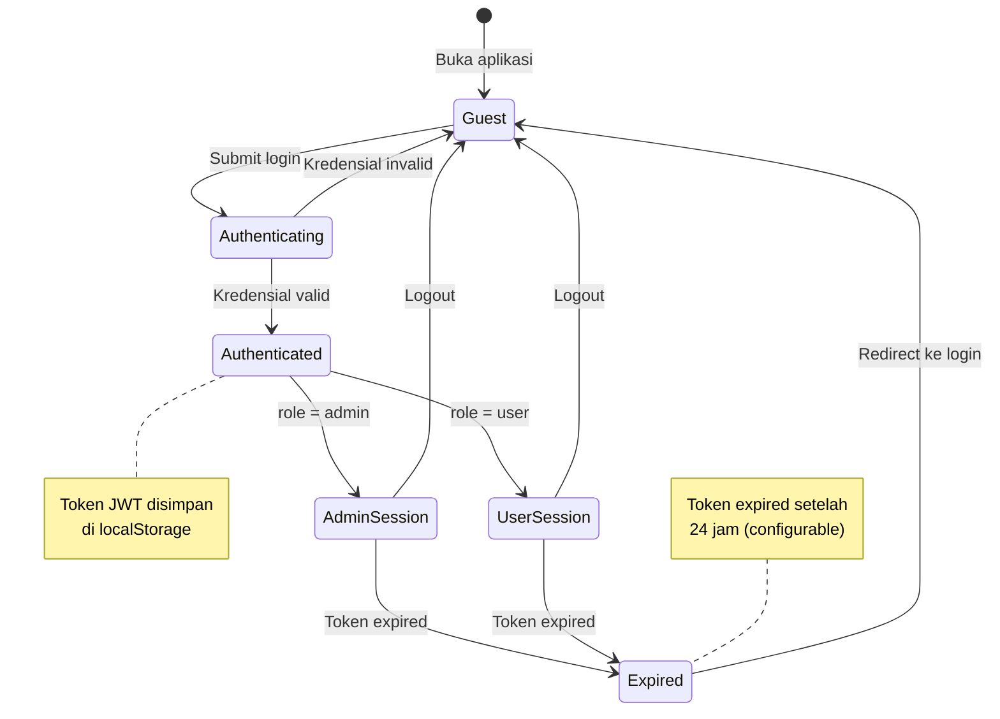
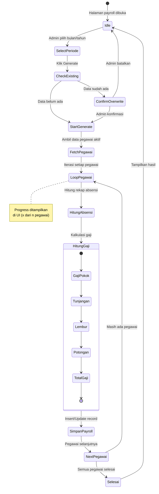
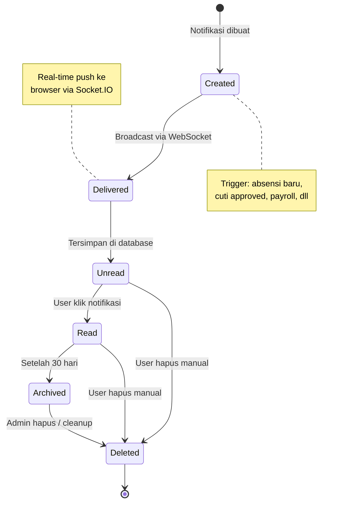

# State Diagram

## 1. State Diagram Pengajuan Cuti

### Tabel State Pengajuan Cuti

| State | Deskripsi | Transisi Keluar | Trigger |
|-------|-----------|-----------------|---------|
| Draft | Karyawan mengisi form | Menunggu, Batal | Submit, Cancel |
| Menunggu | Menunggu approval admin | Disetujui, Ditolak | Admin action |
| Disetujui | Cuti telah disetujui | Aktif | Tanggal mulai tercapai |
| Ditolak | Cuti ditolak admin | End | - |
| Aktif | Karyawan sedang cuti | Selesai | Tanggal selesai tercapai |
| Selesai | Periode cuti selesai | End | - |

---

## 2. State Diagram Absensi Harian

### Tabel State Absensi Harian

| State | Deskripsi | Kondisi | Hasil |
|-------|-----------|---------|-------|
| BelumAbsen | Belum ada aktivitas | Hari kerja dimulai | - |
| SudahMasuk | Fingerprint masuk terdeteksi | Scan berhasil | Record waktu_absen |
| Hadir | Masuk tepat waktu | waktu <= jam_masuk + toleransi | keterangan = 'Hadir' |
| Terlambat | Masuk lewat waktu | waktu > jam_masuk + toleransi | keterangan = 'Terlambat' |
| SudahPulang | Fingerprint keluar terdeteksi | Scan berhasil | Record waktu_keluar |
| Lembur | Bekerja melebihi jam normal | waktu_keluar > jam_lembur | status_lembur = 'Ya' |
| TidakLembur | Pulang normal | waktu_keluar <= jam_lembur | status_lembur = 'Tidak' |
| Alpha | Tidak hadir tanpa keterangan | Tidak ada scan | keterangan = 'Alpha' |

---

## 3. State Diagram Status Pegawai

### Tabel State Status Pegawai

| State | Deskripsi | Dapat Absen | Dapat Login |
|-------|-----------|-------------|-------------|
| Baru | Baru didaftarkan | Tidak | Tidak |
| BelumEnroll | Belum enrollment fingerprint | Tidak | Ya (jika ada akun) |
| Aktif | Status normal aktif bekerja | Ya | Ya |
| Cuti | Sedang dalam masa cuti | Tidak | Ya |
| Nonaktif | Di-suspend/nonaktifkan | Tidak | Tidak |
| Resign | Sudah keluar | Tidak | Tidak |

---

## 4. State Diagram Proses Enrollment Fingerprint

### Tabel State Enrollment

| State | Deskripsi | LED Indicator | Durasi Max |
|-------|-----------|---------------|------------|
| Idle | Standby normal | Hijau steady | - |
| ModeEnrollment | Mode pendaftaran aktif | Kuning blink | 60 detik |
| ScanPertama | Menunggu scan pertama | Kuning | 30 detik |
| CaptureTemplate1 | Memproses template 1 | Kuning fast blink | 2 detik |
| ScanKedua | Menunggu scan kedua | Kuning | 30 detik |
| CaptureTemplate2 | Memproses template 2 | Kuning fast blink | 2 detik |
| Verifikasi | Membandingkan template | Kuning | 1 detik |
| Sukses | Enrollment berhasil | Hijau + buzzer | 3 detik |
| Gagal | Enrollment gagal | Merah + buzzer | 3 detik |
| Timeout | Waktu habis | Merah | 3 detik |

---

## 5. State Diagram Proses Absensi Fingerprint

### Tabel State Absensi Fingerprint

| State | Deskripsi | Output ESP32 | MQTT Topic |
|-------|-----------|--------------|------------|
| Ready | Siap menerima scan | LED hijau steady | - |
| Scanning | Proses capture image | LED biru blink | - |
| Matching | Pencocokan template | LED kuning | - |
| Found | Fingerprint ditemukan | Tampil nama | fingerprint/attendance |
| NotFound | Tidak ditemukan | LED merah, buzzer | fingerprint/failed |
| RecordMasuk | Catat jam masuk | LED hijau, buzzer | fingerprint/checkin |
| RecordKeluar | Catat jam keluar | LED hijau, buzzer | fingerprint/checkout |
| Sukses | Proses selesai | LED hijau 3 detik | fingerprint/success |

---

## 6. State Diagram Sesi User

### Tabel State Sesi User

| State | Deskripsi | Akses Halaman | Token Status |
|-------|-----------|---------------|--------------|
| Guest | Belum login | /login.html saja | Tidak ada |
| Authenticating | Proses login | - | - |
| Authenticated | Login berhasil | Redirect sesuai role | Valid |
| AdminSession | Sesi admin aktif | /admin/* | Valid |
| UserSession | Sesi user aktif | /user/* | Valid |
| Expired | Token kedaluwarsa | - | Expired |

---

## 7. State Diagram Generate Payroll

### Tabel State Generate Payroll

| State | Deskripsi | Progress | Database Action |
|-------|-----------|----------|-----------------|
| Idle | Menunggu input | 0% | - |
| SelectPeriode | Pilih periode | 0% | - |
| CheckExisting | Cek data existing | 5% | SELECT payroll |
| StartGenerate | Mulai generate | 10% | - |
| FetchPegawai | Ambil list pegawai | 15% | SELECT pegawai |
| LoopPegawai | Iterasi pegawai | 15-95% | - |
| HitungAbsensi | Hitung rekap | - | SELECT absensi |
| HitungGaji | Kalkulasi gaji | - | SELECT setting |
| SimpanPayroll | Simpan record | - | INSERT/UPDATE payroll |
| Selesai | Proses selesai | 100% | - |

---

## 8. State Diagram Notifikasi

### Tabel State Notifikasi

| State | Deskripsi | is_read | Umur Data |
|-------|-----------|---------|-----------|
| Created | Baru dibuat | false | 0 |
| Delivered | Sudah terkirim | false | < 1 detik |
| Unread | Belum dibaca | false | - |
| Read | Sudah dibaca | true | - |
| Archived | Diarsipkan | true | > 30 hari |
| Deleted | Dihapus | - | - |

---

*Dokumentasi State Diagram - Sistem Absensi IoT Berbasis Fingerprint*
