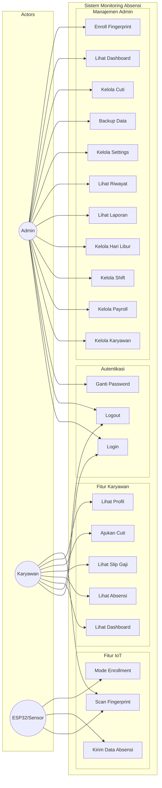
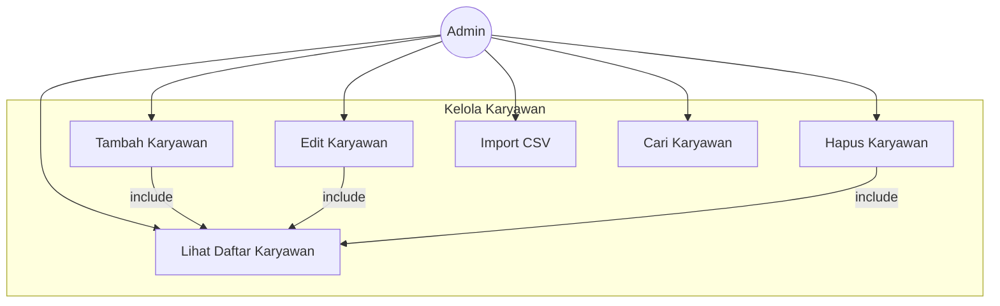
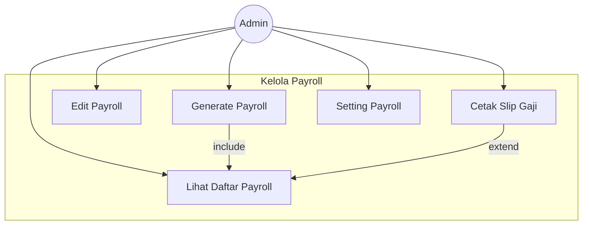
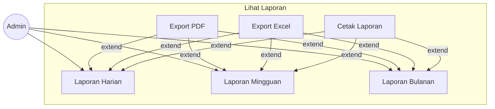
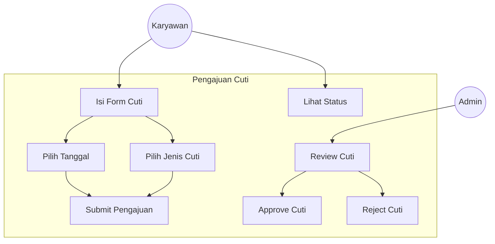

# Use Case Diagram

## 1. Use Case Diagram Keseluruhan

## 2. Deskripsi Use Case

### 2.1 Autentikasi

| Use Case | Aktor | Deskripsi |
|----------|-------|-----------|
| UC1 - Login | Admin, Karyawan | Pengguna memasukkan username dan password untuk masuk ke sistem |
| UC2 - Logout | Admin, Karyawan | Pengguna keluar dari sistem |
| UC3 - Ganti Password | Admin | Admin mengganti password akun |

### 2.2 Manajemen Admin

| Use Case | Aktor | Deskripsi |
|----------|-------|-----------|
| UC4 - Kelola Karyawan | Admin | CRUD data karyawan (tambah, edit, hapus, lihat) |
| UC5 - Kelola Payroll | Admin | Generate dan kelola data penggajian |
| UC6 - Kelola Shift | Admin | Atur jadwal shift kerja karyawan |
| UC7 - Kelola Hari Libur | Admin | Tambah dan kelola daftar hari libur |
| UC8 - Lihat Laporan | Admin | Lihat laporan absensi harian/mingguan/bulanan |
| UC9 - Lihat Riwayat | Admin | Lihat riwayat absensi semua karyawan |
| UC10 - Kelola Settings | Admin | Konfigurasi sistem (perusahaan, jam kerja, MQTT, dll) |
| UC11 - Backup Data | Admin | Backup data ke OwnCloud/WebDAV |
| UC12 - Kelola Cuti | Admin | Approve/reject pengajuan cuti karyawan |
| UC13 - Lihat Dashboard | Admin | Melihat statistik dan overview sistem |
| UC14 - Enroll Fingerprint | Admin | Mendaftarkan sidik jari karyawan baru |

### 2.3 Fitur Karyawan

| Use Case | Aktor | Deskripsi |
|----------|-------|-----------|
| UC15 - Lihat Dashboard | Karyawan | Melihat ringkasan absensi pribadi |
| UC16 - Lihat Absensi | Karyawan | Melihat riwayat absensi pribadi |
| UC17 - Lihat Slip Gaji | Karyawan | Melihat slip gaji bulanan |
| UC18 - Ajukan Cuti | Karyawan | Mengajukan permohonan cuti |
| UC19 - Lihat Profil | Karyawan | Melihat dan update profil pribadi |

### 2.4 Fitur IoT

| Use Case | Aktor | Deskripsi |
|----------|-------|-----------|
| UC20 - Scan Fingerprint | ESP32, Karyawan | Karyawan scan sidik jari untuk absensi |
| UC21 - Kirim Data Absensi | ESP32 | ESP32 mengirim data absensi ke server via MQTT |
| UC22 - Mode Enrollment | ESP32 | ESP32 masuk mode pendaftaran sidik jari baru |

---

## 3. Use Case Detail

### UC4 - Kelola Karyawan

### UC5 - Kelola Payroll

### UC8 - Lihat Laporan

### UC18 - Ajukan Cuti

---

## 4. Skenario Use Case

### Skenario UC1 - Login

**Use Case:** Login
**Aktor:** Admin / Karyawan
**Precondition:** Pengguna memiliki akun terdaftar
**Postcondition:** Pengguna berhasil masuk ke sistem

| Langkah | Aktor | Sistem |
|---------|-------|--------|
| 1 | Buka halaman login | Tampilkan form login |
| 2 | Masukkan username | - |
| 3 | Masukkan password | - |
| 4 | Klik tombol Login | Validasi kredensial |
| 5 | - | Jika valid: redirect ke dashboard |
| 5a | - | Jika tidak valid: tampilkan error |

### Skenario UC4 - Tambah Karyawan

**Use Case:** Tambah Karyawan
**Aktor:** Admin
**Precondition:** Admin sudah login
**Postcondition:** Data karyawan baru tersimpan

| Langkah | Aktor | Sistem |
|---------|-------|--------|
| 1 | Klik tombol "Tambah Karyawan" | Tampilkan form tambah karyawan |
| 2 | Isi data karyawan (NIP, Nama, dll) | - |
| 3 | Upload foto (opsional) | - |
| 4 | Klik tombol Simpan | Validasi data |
| 5 | - | Simpan ke database |
| 6 | - | Tampilkan notifikasi sukses |

### Skenario UC20 - Scan Fingerprint

**Use Case:** Scan Fingerprint
**Aktor:** Karyawan, ESP32
**Precondition:** Sidik jari sudah terdaftar
**Postcondition:** Data absensi tercatat

| Langkah | Aktor | Sistem |
|---------|-------|--------|
| 1 | Letakkan jari pada sensor | ESP32 membaca sidik jari |
| 2 | - | Cocokkan dengan database |
| 3 | - | Jika cocok: ambil data karyawan |
| 4 | - | Kirim data via MQTT |
| 5 | - | Server terima dan simpan absensi |
| 6 | - | Broadcast ke dashboard real-time |
| 7 | - | Tampilkan notifikasi di web |

---

## 5. Matriks Aktor vs Use Case

| Use Case | Admin | Karyawan | ESP32 |
|----------|:-----:|:--------:|:-----:|
| Login | ✓ | ✓ | - |
| Logout | ✓ | ✓ | - |
| Ganti Password | ✓ | - | - |
| Kelola Karyawan | ✓ | - | - |
| Kelola Payroll | ✓ | - | - |
| Kelola Shift | ✓ | - | - |
| Kelola Hari Libur | ✓ | - | - |
| Lihat Laporan | ✓ | - | - |
| Lihat Riwayat | ✓ | - | - |
| Kelola Settings | ✓ | - | - |
| Backup Data | ✓ | - | - |
| Kelola Cuti | ✓ | - | - |
| Lihat Dashboard | ✓ | ✓ | - |
| Enroll Fingerprint | ✓ | - | ✓ |
| Lihat Absensi | - | ✓ | - |
| Lihat Slip Gaji | - | ✓ | - |
| Ajukan Cuti | - | ✓ | - |
| Lihat Profil | - | ✓ | - |
| Scan Fingerprint | - | ✓ | ✓ |
| Kirim Data Absensi | - | - | ✓ |
| Mode Enrollment | - | - | ✓ |
